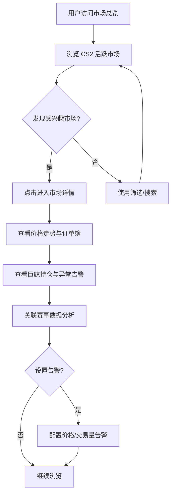
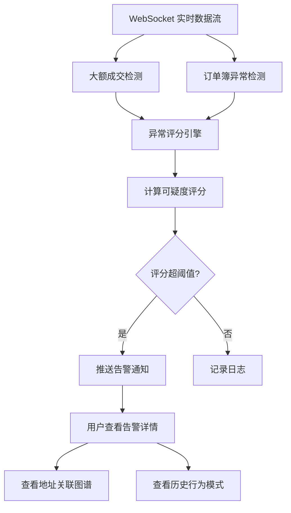
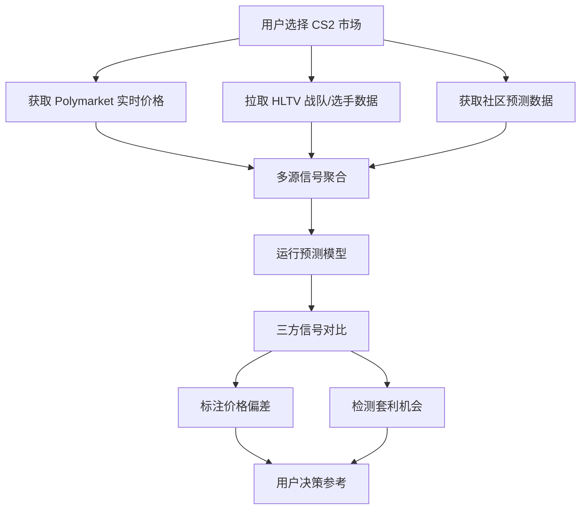
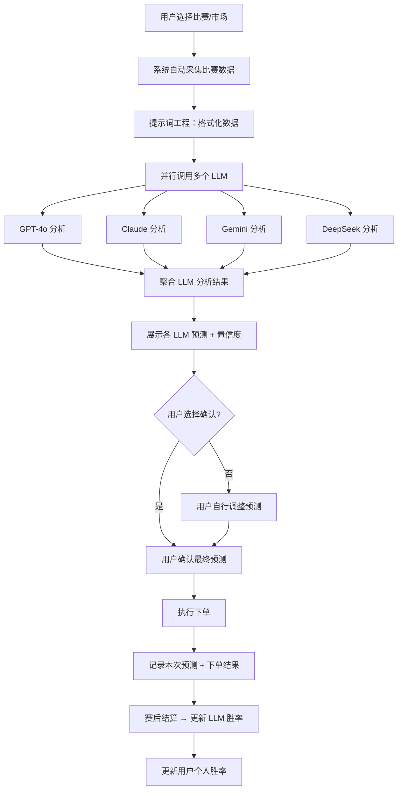

# PolyRader CS2 — 产品需求文档 (PRD)

## 1. 产品概述

PolyRader CS2 是一款面向 Polymarket CS2 电竞预测市场的**开源桌面分析工具**，基于 **Tauri** 框架构建，融合实时数据流、大户追踪、内幕检测与多源信号对比能力，通过**提示词工程驱动多 LLM 并行计算胜率**，帮助用户在 CS2 预测市场中做出更明智的交易决策。

- **核心问题**：Polymarket 上的 CS2 市场信息不对称严重，散户缺乏专业分析工具，难以识别大户行为和异常信号
- **目标用户**：Polymarket CS2 市场交易者、电竞数据分析爱好者、量化交易开发者
- **产品定位**：Tauri 桌面应用，所有功能完全开放，无需注册、无需付费，社区驱动迭代
- **AI 交互方式**：通过提示词工程（Prompt Engineering）自动采集比赛数据、格式化注入、并行调用多个 LLM 计算胜率，**不提供对话式 AI Chat 功能**
- **运行环境**：macOS / Windows / Linux 桌面端，Tauri 打包为原生安装包（.dmg / .msi / .AppImage）
- **数据存储**：本地 SQLite 数据库，用户首次启动选择数据文件夹，所有数据存储在本地
- **LLM Key 管理**：API Key 使用 AES-256-GCM 本地加密存储，密钥存放于 config.json，不依赖环境变量
- **后端架构**：Express server 作为 Tauri sidecar 进程运行，前端通过 localhost 与 sidecar 通信

## 2. 核心功能

### 2.1 桌面应用定位

PolyRader CS2 定位为完全开源的 Tauri 桌面应用，无需注册、无需登录、无需付费。所有功能（市场数据、巨鲸追踪、异常检测、赛事分析、信号对比）均可直接使用。下载安装包即可运行，数据来自公开 API 和链上数据，不依赖任何中心化服务。用户首次启动时选择本地数据存储文件夹，所有数据（SQLite 数据库、配置文件、缓存）均存储在该文件夹中。

### 2.2 功能模块

1. **市场总览仪表板**：CS2 活跃市场一览、实时价格与交易量、市场热力图
2. **每日看板**：自动分析当日比赛，LLM 预分析 + 关注度排序 + 智能推荐
3. **实时数据监控**：订单簿深度、成交流实时推送、价格走势图
4. **巨鲸与内幕追踪**：大户持仓追踪、异常行为评分、可疑交易告警
5. **CS2 赛事分析**：战队/选手数据面板、赛程与预测信号、HLTV 数据集成
6. **多 LLM 分析**：多模型并行预测、提示词工程、结果聚合、用户决策
7. **多源信号对比**：Polymarket 赔率 vs HLTV 排名 vs 社区预测、套利机会检测
8. **AI 投注统计**：LLM 模拟投注追踪、用户投注统计、置信度校准、排行榜
9. **LLM 管理**：API Key 管理、连通性测试、配额监控、独立 LLM 胜率分析

### 2.3 页面详情

| 页面名称 | 模块名称 | 功能描述 |
|----------|----------|----------|
| 市场总览 | 实时市场卡片 | 展示所有 CS2 活跃市场的价格、24h 变化、交易量，支持按赛事/队伍筛选 |
| 市场总览 | 热力图 | 按赛事级别和交易量渲染市场热度，快速发现热门市场 |
| 市场总览 | 趋势市场列表 | 展示交易量激增、价格剧烈变动的异常市场 |
| 每日看板 | 今日概览 | 当日比赛总数、推荐数、高偏差机会数、巨鲸异动数 |
| 每日看板 | 今日推荐卡片 | TOP 3 推荐比赛卡片，关注度评分 + 偏差 + 快速操作 |
| 每日看板 | 全部比赛列表 | 按关注度排序的当日全部比赛，含预测/市场价/偏差/交易量 |
| 每日看板 | 高偏差机会 | 偏差 > 8% 的比赛高亮展示 |
| 每日看板 | 巨鲸异动 | 当日有大户异常交易的比赛汇总 |
| 比赛分析 | 比赛信息头 | 赛事信息、对阵双方、赛制、开赛时间等元数据 |
| 比赛分析 | 双队胜率对比条 | 左右两队名称 + 中间大号百分比 + 双色进度条 |
| 比赛分析 | 胜率分解环形图 | 5 个因子（排名/状态/地图/交锋/市场）各占一个扇区 |
| 比赛分析 | LLM共识仪表盘 | 半圆形仪表盘，指针指向共识胜率，标注各 LLM 预测位置 |
| 比赛分析 | 5维因子分解 | 排名、状态、地图、交锋、市场五个维度的详细分析 |
| 比赛分析 | 价格走势图 | 交互式 K 线/折线图，支持时间范围选择与技术指标叠加 |
| 比赛分析 | 订单簿深度 | 实时买卖盘深度可视化，显示流动性分布 |
| 比赛分析 | 用户决策区 | 确认 LLM 预测 / 自行调整 / 跳过，下单操作入口 |
| 巨鲸追踪 | 大户持仓排行 | 按持仓量排序的地址列表，显示持仓分布与盈亏 |
| 巨鲸追踪 | 异常行为告警 | 实时推送大额买入/卖出、价格前异动等异常事件 |
| 巨鲸追踪 | 可疑度评分面板 | 基于多维度的地址可疑度评分，综合交易时机、金额、频率 |
| 巨鲸追踪 | 地址关联图谱 | 可视化关联地址集群，展示地址间的资金流转关系 |
| 赛事分析 | 战队数据面板 | HLTV 排名、近期胜率、地图池分析、交锋记录 |
| 赛事分析 | 选手数据面板 | Rating 2.0、ADR、KAST%、Impact 等核心指标 |
| 赛事分析 | 赛程日历 | 即将进行的 CS2 赛事时间表，关联 Polymarket 市场 |
| 赛事分析 | 预测信号 | 基于赛事数据的胜率预测，与市场赔率对比 |
| 信号对比 | 多源赔率对比 | Polymarket 价格 vs 预测模型 vs 社区共识的三方对比 |
| 信号对比 | 套利扫描器 | 跨市场/跨结果的价格差异检测，标注潜在套利机会 |
| 信号对比 | 信号偏差热图 | 市场价格偏离预测模型的热力可视化 |
| AI 配置 | API Key 配置 | 各 Provider 的 Key 配置、加密存储、掩码显示 |
| AI 配置 | 连通性测试 | 一键测试各 Provider 的连接状态、延迟、模型可用性 |
| AI 配置 | 配额与用量 | 本月 Token 用量、费用估算、速率限制状态、历史趋势 |
| AI 胜率统计 | LLM 排行榜 | 按准确率/ROI/夏普比率排序的各 LLM 表现 |
| AI 胜率统计 | 用户统计面板 | 用户总预测数、准确率、盈亏、夏普比率、vs LLM 对比 |
| AI 胜率统计 | 投注历史记录 | 每次预测的详细记录（比赛/LLM共识/用户决策/结果/盈亏） |
| AI 胜率统计 | 置信度校准曲线 | 各 LLM 的预测置信度 vs 实际胜率散点图 |
| AI 胜率统计 | 模拟投注追踪 | 每个 LLM 的模拟投注盈亏曲线、最大回撤 |
| AI 胜率统计 | LLM 胜率分析 | 单个 LLM 的深度表现分析（赛事级别/方向/置信度/战队） |

## 3. 核心流程

### 3.1 市场发现与监控流程

用户打开市场总览 → 浏览 CS2 活跃市场 → 点击感兴趣的市场 → 查看价格走势与订单簿 → 设置价格/交易量告警 → 持续监控



### 3.2 巨鲸追踪与内幕检测流程

系统监听 WebSocket 数据流 → 检测大额成交 → 触发异常评分引擎 → 计算可疑度 → 推送告警 → 用户查看详情与地址图谱



### 3.3 多源信号对比流程

用户选择市场 → 系统获取 Polymarket 价格 → 拉取 HLTV 排名/数据 → 运行预测模型 → 三方信号对比 → 标注偏差与套利机会



### 3.4 多 LLM 分析决策流程（核心新增）

**业务链路**：数据采集 → 提示词工程 → 多模型并行分析 → 用户确认 → 下单 → 胜率统计



**核心价值**：
- 用户不需要自己分析数据，系统自动采集并格式化比赛相关数据
- 多个 LLM 同时从不同角度分析同一场比赛，提供多视角参考
- 用户作为最终决策者，确认或调整 LLM 的预测
- 系统持续追踪每个 LLM 和用户个人的预测准确率

### 3.5 提示词工程流程

```
用户选择比赛 "NaVi vs FaZe, BO3, IEM Katowice"
  │
  ▼
┌─────────────────────────────────────────────────┐
│  Step 1: 数据采集                                │
│  - HLTV 排名: NaVi #3, FaZe #8                  │
│  - 近期战绩: NaVi 7W-3L, FaZe 5W-5L              │
│  - 地图池: Nuke(75%), Ancient(70%), Mirage(65%)  │
│  - 交锋记录: NaVi 3-1 FaZe (近1年)               │
│  - 选手数据: b1t 1.18, ropz 1.14                │
│  - Polymarket: NaVi Yes $0.62, 24h Vol $245K    │
│  - 巨鲸动向: 2 个大户买入 NaVi                   │
└─────────────────────────────────────────────────┘
  │
  ▼
┌─────────────────────────────────────────────────┐
│  Step 2: 提示词模板渲染                           │
│                                                  │
│  System Prompt:                                  │
│  "你是一位专业的 CS2 电竞分析师。基于以下数据，    │
│   预测 NaVi vs FaZe 的胜者，并给出置信度(0-100)。  │
│   输出格式: JSON { winner, confidence, reasoning }"│
│                                                  │
│  User Prompt (数据注入):                          │
│  "比赛: NaVi vs FaZe, BO3, IEM Katowice          │
│   排名: NaVi #3(845pts), FaZe #8(712pts)          │
│   近期: NaVi 7W-3L, FaZe 5W-5L                    │
│   地图池胜率:                                      │
│     Nuke: NaVi 75% vs FaZe 25%                    │
│     Ancient: NaVi 70% vs FaZe 30%                 │
│     Mirage: NaVi 65% vs FaZe 35%                  │
│     Inferno: NaVi 32% vs FaZe 68%                 │
│     Vertigo: NaVi 28% vs FaZe 72%                 │
│   交锋: NaVi 3-1 FaZe (近1年)                     │
│   选手: b1t 1.18, ropz 1.14                       │
│   市场: NaVi Yes $0.62, 24h Vol $245K             │
│   巨鲸: 2 大户买入 NaVi                            │
│   请预测胜者并给出置信度。"                         │
└─────────────────────────────────────────────────┘
  │
  ▼
┌─────────────────────────────────────────────────┐
│  Step 3: 并行调用 LLM                             │
│  ┌──────────┐ ┌──────────┐ ┌──────────┐ ┌──────┐│
│  │ GPT-4o   │ │ Claude   │ │ Gemini   │ │DeepS ││
│  │ NaVi 70% │ │ NaVi 65% │ │ NaVi 72% │ │NaVi  ││
│  │ conf: 75 │ │ conf: 70 │ │ conf: 80 │ │ 68%  ││
│  └──────────┘ └──────────┘ └──────────┘ └──────┘│
│                                                  │
│  共识结果: NaVi 胜率 68.75% (4/4 一致)            │
│  平均置信度: 76.25                                │
└─────────────────────────────────────────────────┘
  │
  ▼
┌─────────────────────────────────────────────────┐
│  Step 4: 用户决策                                 │
│  ┌──────────────────────────────────────────┐   │
│  │  LLM 共识: NaVi 68.75%                    │   │
│  │  市场定价: NaVi 62%                        │   │
│  │  偏差: +6.75% (市场低估 NaVi)              │   │
│  │                                          │   │
│  │  [确认 LLM 预测] [自行调整] [跳过]         │   │
│  └──────────────────────────────────────────┘   │
│                                                  │
│  用户点击 [确认 LLM 预测] → 下单 BUY NaVi Yes     │
│  或用户调整为 NaVi 65% → 下单                     │
└─────────────────────────────────────────────────┘
```

## 4. 多 LLM 分析模块

### 4.1 支持的 LLM 列表

| LLM | 提供商 | API | 特点 |
|-----|--------|-----|------|
| GPT-4o | OpenAI | `api.openai.com` | 综合能力强，推理深度好 |
| Claude 3.5 Sonnet | Anthropic | `api.anthropic.com` | 逻辑分析强，长文本处理好 |
| Gemini 2.0 Flash | Google | `generativelanguage.googleapis.com` | 速度快，成本低 |
| DeepSeek V3 | DeepSeek | `api.deepseek.com` | 性价比高，中文友好 |
| Grok 2 | xAI | `api.x.ai` | 实时信息感知 |
| Llama 3.3 | Groq/本地 | `api.groq.com` | 开源可本地部署 |

用户可自由选择启用哪些 LLM，至少选择 1 个，推荐 3-4 个以获得多视角参考。

### 4.2 提示词工程架构

#### 4.2.1 提示词分层设计

```
┌────────────────────────────────────────────┐
│  Layer 1: System Prompt (角色定义)           │
│  定义 LLM 为 CS2 电竞分析师，规定输出格式      │
├────────────────────────────────────────────┤
│  Layer 2: Context Template (上下文模板)      │
│  注入比赛基础信息、赛制、赛事级别              │
├────────────────────────────────────────────┤
│  Layer 3: Data Injection (数据注入)          │
│  动态填充：排名、战绩、地图、交锋、选手、市场   │
├────────────────────────────────────────────┤
│  Layer 4: Output Schema (输出约束)           │
│  强制 JSON 格式输出，包含 winner/confidence/  │
│  reasoning/key_factors                      │
└────────────────────────────────────────────┘
```

#### 4.2.2 数据采集清单

系统自动采集以下数据并注入提示词：

| 数据类别 | 具体字段 | 数据源 |
|---------|---------|--------|
| 比赛基础 | 队伍名、赛制(BO1/BO3/BO5)、赛事名、级别 | HLTV + Gamma API |
| 排名数据 | 双方 HLTV 排名、积分 | HLTV 爬虫 |
| 近期状态 | 近 10 场胜负、近 30 天胜率 | HLTV 爬虫 |
| 地图池 | 双方每张地图的胜率 | HLTV 爬虫 |
| 交锋记录 | 历史对阵结果、最近一次比分 | HLTV 爬虫 |
| 选手数据 | 核心选手 Rating 2.0、ADR、KAST、Impact | HLTV 爬虫 |
| 市场数据 | Polymarket 当前价格、24h 交易量、价格趋势 | Gamma API + CLOB WS |
| 巨鲸动向 | 大户持仓方向、近期大单 | 链上数据 + Data API |

#### 4.2.3 提示词模板示例

```
System:
你是一位专业的 CS2 电竞分析师，拥有 10 年电竞分析经验。
你的任务是分析即将进行的 CS2 比赛，预测胜者并给出置信度。

分析框架：
1. 排名与实力对比：分析双方 HLTV 排名差距和近期状态
2. 地图池分析：分析 BO3 赛制下地图 ban/pick 对双方的影响
3. 交锋记录：分析历史对阵的心理优势和战术克制
4. 选手状态：分析核心选手的近期表现
5. 市场信号：分析 Polymarket 市场的资金流向和定价

输出格式（严格 JSON）：
{
  "winner": "TeamA 或 TeamB",
  "confidence": 0-100 的整数,
  "reasoning": "200字以内的分析推理",
  "key_factors": ["因素1", "因素2", "因素3"],
  "risk_factors": ["风险1", "风险2"],
  "recommended_action": "BUY 或 SELL 或 HOLD"
}

User:
请分析以下比赛：
{比赛数据 JSON}
```

### 4.3 LLM 分析结果聚合

#### 4.3.1 聚合算法

```
输入: N 个 LLM 的预测结果 [{ winner, confidence, reasoning }]

Step 1: 投票统计
  - 统计每个队伍的 LLM 投票数
  - 共识度 = 多数票 / 总票数

Step 2: 加权平均置信度
  - 每个 LLM 有历史准确率权重 W_i
  - 加权置信度 = Σ(confidence_i × W_i) / Σ(W_i)

Step 3: 一致性检测
  - 全票通过 → 高共识（绿色标记）
  - 多数通过 → 中共识（黄色标记）
  - 分歧较大 → 低共识（红色标记，建议谨慎）

Step 4: 输出聚合结果
  {
    consensus_winner: "TeamA",
    consensus_pct: 68.75,
    vote_distribution: { TeamA: 4, TeamB: 0 },
    consensus_level: "high",
    weighted_confidence: 76.25,
    individual_results: [...]
  }
```

#### 4.3.2 前端展示

| 元素 | 说明 |
|------|------|
| LLM 共识卡片 | 显示共识胜者、胜率、共识度标签 |
| 各 LLM 结果卡片 | 每个 LLM 的预测、置信度、推理摘要 |
| 对比市场定价 | LLM 共识 vs Polymarket 价格，标注偏差 |
| 用户操作区 | 确认 LLM 预测 / 自行调整 / 跳过 |

### 4.4 用户决策与下单

```
用户看到 LLM 分析结果后：

选项 1: 确认 LLM 共识预测
  → 系统使用 LLM 共识胜率作为下单依据
  → 弹出下单确认框（市场、方向、价格、数量）
  → 用户确认 → 执行下单

选项 2: 自行调整预测
  → 用户手动输入自己的胜率判断
  → 系统记录"用户预测 vs LLM 预测"的差异
  → 弹出下单确认框
  → 用户确认 → 执行下单

选项 3: 跳过
  → 不执行下单，仅记录 LLM 分析结果
  → 赛后仍可追踪 LLM 预测准确率
```

### 4.5 胜率统计系统

#### 4.5.1 统计维度

| 维度 | 说明 | 计算方式 |
|------|------|---------|
| 各 LLM 准确率 | 每个 LLM 的历史预测准确率 | 正确预测数 / 总预测数 |
| 各 LLM 置信度校准 | LLM 的置信度是否准确 | 实际胜率 vs 预测置信度的偏差 |
| LLM 共识准确率 | 多数 LLM 一致时的准确率 | 共识正确数 / 共识总次数 |
| 用户个人胜率 | 用户最终下单的准确率 | 用户正确数 / 用户总下单数 |
| 用户 vs LLM | 用户是否比 LLM 更准确 | 用户准确率 - LLM 共识准确率 |

#### 4.5.2 统计页面

| 模块 | 内容 |
|------|------|
| LLM 排行榜 | 按准确率排序的各 LLM 表现 |
| 置信度校准曲线 | 各 LLM 的预测置信度 vs 实际胜率散点图 |
| 用户统计面板 | 用户总预测数、准确率、盈亏、夏普比率 |
| 历史记录表 | 每次预测的详细记录（比赛、LLM 预测、用户决策、结果） |
| 趋势图 | 用户准确率随时间的变化趋势 |

#### 4.5.3 数据模型

```
PredictionRecord:
  - id: 唯一标识
  - match_id: 比赛 ID
  - market_id: Polymarket 市场 ID
  - match_data: 采集的比赛数据快照 (JSON)
  - llm_results: 各 LLM 的预测结果 (JSON)
  - llm_consensus: LLM 共识结果
  - user_prediction: 用户最终预测 (可为 null)
  - user_action: 确认/调整/跳过
  - order_executed: 是否下单
  - order_details: 下单详情 (可为 null)
  - actual_result: 实际比赛结果 (赛后填充)
  - created_at: 创建时间
  - resolved_at: 结算时间
```

## 5. AI LLM 投注结果统计

### 5.1 模块定位

AI LLM 投注结果统计模块是整个系统的"成绩单"——持续追踪每个 LLM 的预测准确率、实际投注结果和盈亏表现，帮助用户了解哪个 LLM 最值得信赖，以及自己的决策是否优于 AI。

### 5.2 统计维度

| 维度 | 说明 | 计算方式 |
|------|------|---------|
| LLM 预测准确率 | 每个 LLM 预测胜者的正确率 | 正确预测数 / 总预测数 |
| LLM 投注收益率 (ROI) | 按 LLM 建议投注的模拟盈亏 | (模拟盈亏 / 模拟投注总额) × 100% |
| LLM 夏普比率 | 风险调整后收益 | (平均收益 - 无风险利率) / 收益标准差 |
| LLM 最大回撤 | 模拟投注的最大亏损幅度 | 峰值到谷底的最大跌幅 |
| 用户实际收益率 | 用户实际下单的盈亏 | (实际盈亏 / 实际投注总额) × 100% |
| 用户 vs LLM 对比 | 用户决策是否优于 LLM 共识 | 用户准确率 - LLM 共识准确率 |
| 按赛事级别统计 | S-Tier / A-Tier 分别统计 | 分组聚合 |
| 按时间维度统计 | 近7天/30天/90天/全部 | 时间窗口聚合 |

### 5.3 投注模拟引擎

系统在每次 LLM 分析后自动生成模拟投注记录，用于追踪 LLM 的"虚拟战绩"：

```
输入: LLM 预测结果 + Polymarket 当时价格
输出: 模拟投注记录

模拟规则:
  - 每次 LLM 给出 BUY 建议 → 模拟以当时市场价买入 100 USDC
  - 每次 LLM 给出 SELL 建议 → 模拟以当时市场价卖出 100 USDC
  - 每次 LLM 给出 HOLD 建议 → 不模拟投注
  - 比赛结束后 → 根据实际结果结算模拟盈亏
  - 胜者正确 → 盈利 = 100 × (1/买入价 - 1)
  - 胜者错误 → 亏损 = -100
```

### 5.4 统计页面设计

#### 5.4.1 LLM 排行榜

| 排名 | LLM | 预测次数 | 准确率 | 模拟 ROI | 夏普比率 | 最大回撤 | 趋势 |
|------|-----|---------|--------|---------|---------|---------|------|
| 1 | GPT-4o | 45 | 71.1% | +18.5% | 2.1 | -8.2% | ↑ |
| 2 | Claude 3.5 | 42 | 69.0% | +15.2% | 1.9 | -10.5% | ↑ |
| 3 | Gemini 2.0 | 38 | 65.8% | +11.3% | 1.5 | -14.1% | → |
| 4 | DeepSeek V3 | 40 | 62.5% | +8.7% | 1.2 | -18.3% | ↓ |

#### 5.4.2 用户统计面板

```
┌─────────────────────────────────────────────────────────┐
│  Your Performance                                        │
│                                                          │
│  总预测次数: 32    准确率: 68.8%    总盈亏: +$1,245       │
│  夏普比率: 1.85   最大回撤: -12.3%   vs LLM共识: +2.1%   │
│                                                          │
│  [准确率趋势图]  [盈亏曲线]  [月度热力图]                  │
└─────────────────────────────────────────────────────────┘
```

#### 5.4.3 投注历史记录表

| 日期 | 比赛 | LLM 共识 | 用户决策 | 投注 | 结果 | 盈亏 |
|------|------|---------|---------|------|------|------|
| 06-15 | NaVi vs FaZe | NaVi 71% | 确认 | BUY $100 | ✅ | +$61 |
| 06-14 | G2 vs Vitality | G2 48% | 调整→G2 55% | BUY $100 | ❌ | -$100 |
| 06-14 | Spirit vs MOUZ | Spirit 57% | 跳过 | — | ✅ | — |
| 06-13 | ENCE vs Astralis | ENCE 43% | 确认 | SELL $100 | ✅ | +$143 |

### 5.5 置信度校准分析

```
校准曲线: 横轴=LLM预测置信度区间, 纵轴=实际胜率

理想情况: 对角线（预测60%置信度 → 实际60%胜率）
GPT-4o:   略高于对角线（偏保守，实际胜率高于预测置信度）
Claude:   接近对角线（校准良好）
Gemini:   略低于对角线（偏乐观，实际胜率低于预测置信度）

校准误差 = Σ|实际胜率 - 预测置信度| / 区间数
```

---

## 6. 每日看板 (Daily Dashboard)

### 6.1 模块定位

每日看板是用户打开工具后的第一屏，自动分析当日所有 CS2 比赛，利用 LLM 预分析筛选出最值得关注的比赛，帮助用户快速决策，无需手动逐个查看。

### 6.2 自动分析流程

```
每日定时触发（如 UTC 00:00 / 用户首次打开）
  │
  ▼
┌─────────────────────────────────────────────────────────┐
│  Step 1: 扫描当日比赛                                     │
│  - 从 Gamma API 获取当日所有活跃 CS2 市场                  │
│  - 从 HLTV 获取当日赛程                                   │
│  - 合并去重，生成当日比赛列表                              │
└─────────────────────────────────────────────────────────┘
  │
  ▼
┌─────────────────────────────────────────────────────────┐
│  Step 2: 自动数据采集                                     │
│  - 对每场比赛自动采集：排名、战绩、地图、交锋、选手、市场   │
│  - 缓存采集结果，避免重复请求                              │
└─────────────────────────────────────────────────────────┘
  │
  ▼
┌─────────────────────────────────────────────────────────┐
│  Step 3: LLM 预分析（轻量模式）                            │
│  - 使用成本最低的 LLM（如 Gemini Flash）进行快速预分析      │
│  - 对每场比赛生成：预测胜者、置信度、关注度评分              │
│  - 关注度评分 = f(置信度, 市场偏差, 交易量, 巨鲸活跃度)     │
└─────────────────────────────────────────────────────────┘
  │
  ▼
┌─────────────────────────────────────────────────────────┐
│  Step 4: 智能排序与推荐                                   │
│  - 按关注度评分降序排列                                   │
│  - 标注 TOP 3 "今日推荐"                                  │
│  - 标注"高偏差机会"（模型 vs 市场偏差 > 8%）               │
│  - 标注"巨鲸异动"（有大户异常交易的比赛）                  │
└─────────────────────────────────────────────────────────┘
```

### 6.3 关注度评分算法

```
关注度评分 = 
  0.30 × 置信度因子（LLM 预测置信度 / 100）
+ 0.25 × 偏差因子（|模型预测 - 市场定价| / 0.15，上限 1.0）
+ 0.20 × 交易量因子（log(24h交易量) / log(最大交易量)）
+ 0.15 × 巨鲸因子（有巨鲸活动 = 1.0，无 = 0.3）
+ 0.10 × 赛事级别因子（S-Tier = 1.0，A-Tier = 0.7，其他 = 0.4）

输出: 0-100 的整数评分
```

### 6.4 每日看板页面设计

```
┌─────────────────────────────────────────────────────────┐
│  每日看板 — 2025-06-16                                    │
│                                                          │
│  ┌──────────────────────────────────────────────────┐   │
│  │  今日概览: 8 场比赛 | 3 个推荐 | 2 个高偏差 | 1 个巨鲸异动 │   │
│  └──────────────────────────────────────────────────┘   │
│                                                          │
│  ┌─────────────────────────────────────────────────────┐ │
│  │  🔥 今日推荐 (TOP 3)                                  │ │
│  │                                                      │ │
│  │  ┌──────────┐  ┌──────────┐  ┌──────────┐          │ │
│  │  │ #1        │  │ #2        │  │ #3        │          │ │
│  │  │ NaVi vs   │  │ Spirit vs │  │ G2 vs     │          │ │
│  │  │ FaZe      │  │ MOUZ      │  │ Vitality  │          │ │
│  │  │ 关注度:92 │  │ 关注度:85 │  │ 关注度:78 │          │ │
│  │  │ 偏差+9%  │  │ 偏差+7%  │  │ 偏差-5%  │          │ │
│  │  │ [深度分析]│  │ [深度分析]│  │ [深度分析]│          │ │
│  │  └──────────┘  └──────────┘  └──────────┘          │ │
│  └─────────────────────────────────────────────────────┘ │
│                                                          │
│  ┌─────────────────────────────────────────────────────┐ │
│  │  全部比赛 (按关注度排序)                                │ │
│  │                                                      │ │
│  │  关注度 │ 比赛 │ 预测 │ 市场价 │ 偏差 │ 交易量 │ 操作   │ │
│  │  92 🔥 │ NaVi vs FaZe │ NaVi 71% │ $0.62 │ +9% │ $245K │ [分析] │ │
│  │  85 🔥 │ Spirit vs MOUZ │ Spirit 57% │ $0.48 │ +9% │ $320K │ [分析] │ │
│  │  78    │ G2 vs Vitality │ G2 48% │ $0.55 │ -7% │ $180K │ [分析] │ │
│  │  65    │ Cloud9 vs FURIA │ C9 56% │ $0.51 │ +5% │ $156K │ [分析] │ │
│  │  52    │ ENCE vs Astralis │ ENCE 43% │ $0.41 │ +2% │ $95K │ [分析] │ │
│  │  38    │ Heroic vs BIG │ Heroic 55% │ $0.57 │ -2% │ $78K │ [分析] │ │
│  └─────────────────────────────────────────────────────┘ │
│                                                          │
│  ┌─────────────────────────────────────────────────────┐ │
│  │  ⚡ 高偏差机会 (偏差 > 8%)                              │ │
│  │  NaVi vs FaZe: 模型 71% vs 市场 62%，偏差 +9%          │ │
│  │  Spirit vs MOUZ: 模型 57% vs 市场 48%，偏差 +9%        │ │
│  └─────────────────────────────────────────────────────┘ │
│                                                          │
│  ┌─────────────────────────────────────────────────────┐ │
│  │  🐋 巨鲸异动                                          │ │
│  │  Spirit vs MOUZ: 3 个关联地址同时建仓，可疑度 82        │ │
│  └─────────────────────────────────────────────────────┘ │
└─────────────────────────────────────────────────────────┘
```

### 6.5 预分析缓存策略

| 条件 | 缓存策略 |
|------|---------|
| 比赛数据未变化 | 使用缓存结果，不重复调用 LLM |
| 比赛数据变化（排名更新/价格大幅变动） | 自动重新分析 |
| 距离开赛 < 1 小时 | 强制刷新分析 |
| 用户手动触发 | 使用完整 LLM 分析（非轻量模式） |

### 6.6 页面路由

| 路由 | 用途 |
|------|------|
| `/daily` | 每日看板，自动分析当日比赛并推荐 |

---

## 7. LLM 管理模块

### 7.1 模块定位

LLM 管理模块是系统的"模型控制中心"，提供 API Key 管理、连通性测试、配额监控和独立的 LLM 胜率分析功能。用户可以在此配置各个 LLM Provider 的 API Key，测试连接状态，查看剩余配额和用量，以及深入分析每个 LLM 的预测表现。

### 7.2 API Key 管理

#### 7.2.1 支持的 Provider

| Provider | 配置项 | 获取方式 |
|----------|---------|---------|
| OpenAI (GPT-4o) | `OPENAI_API_KEY` | platform.openai.com/api-keys |
| Anthropic (Claude) | `ANTHROPIC_API_KEY` | console.anthropic.com |
| Google (Gemini) | `GEMINI_API_KEY` | aistudio.google.com/apikey |
| DeepSeek (V3) | `DEEPSEEK_API_KEY` | platform.deepseek.com |
| xAI (Grok) | `XAI_API_KEY` | console.x.ai |
| Groq (Llama) | `GROQ_API_KEY` | console.groq.com |

#### 7.2.2 Key 管理功能

| 功能 | 说明 |
|------|------|
| Key 配置 | 通过 UI 界面为每个 Provider 配置 API Key，存储在本地加密文件中 |
| Key 加密存储 | Key 使用 AES-256-GCM 加密存储在用户数据文件夹，加密密钥存放于 config.json |
| Key 掩码显示 | 界面仅显示 Key 的前 4 位和后 4 位，中间用 `****` 代替 |
| Key 有效性验证 | 配置后自动发送测试请求验证 Key 是否有效 |
| 一键复制 | 支持复制完整 Key（需二次确认） |
| 本地持久化 | 所有 Key 存储在用户选择的本地数据文件夹中，不上传任何服务器 |

### 7.3 连通性测试

#### 7.3.1 测试维度

| 测试项 | 说明 | 判断标准 |
|--------|------|---------|
| API 可达性 | 能否成功连接到 Provider API | HTTP 200 |
| 认证有效性 | API Key 是否有效 | 非 401/403 |
| 响应延迟 | 请求到响应的耗时 | < 5s 正常，5-10s 警告，> 10s 异常 |
| 模型可用性 | 指定模型是否可用 | 返回有效模型列表 |
| 速率限制 | 当前是否被限流 | 非 429 |

#### 7.3.2 测试流程

```
用户点击 [测试连接] → 系统发送最小化测试请求 → 显示结果

测试请求示例（OpenAI）:
POST https://api.openai.com/v1/chat/completions
{
  "model": "gpt-4o",
  "messages": [{"role": "user", "content": "ping"}],
  "max_tokens": 1
}

成功响应:
✅ 连接正常 | 延迟: 245ms | 模型: gpt-4o 可用

失败响应:
❌ 连接失败 | 错误: 401 Unauthorized | Key 无效或已过期
```

### 7.4 配额与用量监控

#### 7.4.1 监控指标

| 指标 | 说明 | 数据来源 |
|------|------|---------|
| 本月已用 Token | 当前计费周期内消耗的 Token 数 | 本地计数器 + Provider API |
| 本月已用费用 | 当前计费周期内的预估费用 | Token 数 × 单价 |
| 速率限制状态 | 当前 RPM/TPM 使用率 | Provider API 响应头 |
| 剩余配额 | 硬限额下的剩余额度 | Provider API |
| 历史用量趋势 | 过去 30 天的每日用量 | 本地数据库 |

#### 7.4.2 费用估算

| Provider | 模型 | 输入价格 (per 1M tokens) | 输出价格 (per 1M tokens) |
|----------|------|------------------------|------------------------|
| OpenAI | GPT-4o | $2.50 | $10.00 |
| Anthropic | Claude 3.5 Sonnet | $3.00 | $15.00 |
| Google | Gemini 2.0 Flash | $0.10 | $0.40 |
| DeepSeek | DeepSeek V3 | $0.27 | $1.10 |
| xAI | Grok 2 | $2.00 | $10.00 |
| Groq | Llama 3.3 70B | $0.59 | $0.79 |

#### 7.4.3 用量面板设计

```
┌─────────────────────────────────────────────────────────┐
│  LLM 用量概览 — 2025-06                                    │
│                                                          │
│  ┌──────────┐ ┌──────────┐ ┌──────────┐ ┌──────────┐   │
│  │ GPT-4o   │ │ Claude   │ │ Gemini   │ │ DeepSeek │   │
│  │ 1.2M tok │ │ 0.8M tok │ │ 2.5M tok │ │ 1.5M tok │   │
│  │ $14.50   │ │ $14.40   │ │ $1.25    │ │ $2.06    │   │
│  │ ████░░░░ │ │ ███░░░░░ │ │ ██████░░ │ │ ████░░░░ │   │
│  └──────────┘ └──────────┘ └──────────┘ └──────────┘   │
│                                                          │
│  本月总费用: $32.21                                       │
│  日均费用: $1.07                                          │
│  预估月费: $33.17                                         │
└─────────────────────────────────────────────────────────┘
```

### 7.5 LLM 胜率分析（独立页面）

#### 7.5.1 模块定位

LLM 胜率分析页面是每个 LLM 的"成绩单"，提供比投注统计排行榜更深入的单个 LLM 表现分析。用户可以在此深入了解某个 LLM 的预测模式、优势和弱点。

#### 7.5.2 分析维度

| 维度 | 说明 |
|------|------|
| 总体表现 | 准确率、ROI、夏普比率、最大回撤的趋势图 |
| 按赛事级别 | S-Tier vs A-Tier 的分别表现 |
| 按预测方向 | BUY 建议 vs SELL 建议的分别准确率 |
| 按置信度区间 | 不同置信度区间的实际胜率（校准曲线） |
| 按地图池 | 不同地图上的预测准确率 |
| 按战队 | 对各战队的预测准确率（是否有偏好） |
| 时间趋势 | 准确率随时间的移动平均线 |
| 盈亏曲线 | 模拟投注的累计盈亏曲线 |

#### 7.5.3 页面设计

```
┌─────────────────────────────────────────────────────────┐
│  LLM 胜率分析 — GPT-4o                                    │
│                                                          │
│  ┌──────────────────────────────────────────────────┐   │
│  │  总体表现                                          │   │
│  │  准确率: 71.1%  ROI: +18.5%  夏普: 2.1  回撤: -8.2% │   │
│  │  [准确率趋势图 — 30天折线]                          │   │
│  └──────────────────────────────────────────────────┘   │
│                                                          │
│  ┌─────────────────────┐ ┌─────────────────────────┐    │
│  │ 按赛事级别            │ │ 按预测方向               │    │
│  │ S-Tier: 73.2% (n=28) │ │ BUY: 74.1% (n=27)       │    │
│  │ A-Tier: 67.8% (n=17) │ │ SELL: 66.7% (n=18)      │    │
│  │ [分组柱状图]          │ │ [对比柱状图]              │    │
│  └─────────────────────┘ └─────────────────────────┘    │
│                                                          │
│  ┌──────────────────────────────────────────────────┐   │
│  │  置信度校准曲线                                     │   │
│  │  [散点图: 横轴=预测置信度, 纵轴=实际胜率]            │   │
│  │  校准误差: 3.2% (优秀)                              │   │
│  └──────────────────────────────────────────────────┘   │
│                                                          │
│  ┌──────────────────────────────────────────────────┐   │
│  │  模拟投注盈亏曲线                                   │   │
│  │  [累计盈亏折线图, 标注最大回撤区间]                  │   │
│  └──────────────────────────────────────────────────┘   │
│                                                          │
│  ┌──────────────────────────────────────────────────┐   │
│  │  按战队预测表现                                     │   │
│  │  NaVi: 80% (10/12.5)  FaZe: 75% (9/12)            │   │
│  │  G2: 66.7% (8/12)     Vitality: 62.5% (5/8)       │   │
│  │  [战队准确率热力图]                                 │   │
│  └──────────────────────────────────────────────────┘   │
└─────────────────────────────────────────────────────────┘
```

### 7.6 页面路由

| 路由 | 用途 |
|------|------|
| `/llm/manage` | LLM 管理页面（Key 管理 + 连通性测试 + 配额监控） |
| `/llm/analysis/:providerId` | 单个 LLM 胜率分析页面 |

---

## 8. 多 LLM 资金分配分析

### 8.1 模块定位

多 LLM 资金分配分析模块是系统的"资金管理大脑"——当多个 LLM 对同一场比赛给出不同预测时，系统基于 Kelly Criterion（凯利公式）和现代投资组合理论，自动计算最优资金分配方案，帮助用户在不同 LLM 建议间科学分配下注资金。

### 8.2 核心功能

| 功能 | 说明 |
|------|------|
| **LLM 预测对比矩阵** | 所有 LLM 对同一场比赛的预测值、置信度、历史准确率的并排对比 |
| **Kelly 最优下注比例** | 基于每个 LLM 的历史胜率和当前赔率，计算 Kelly Criterion 最优下注比例 |
| **资金池分配方案** | 给定总资金池（如 $1000），自动计算每个 LLM 建议方向的最优分配金额 |
| **风险-收益可视化** | 以散点图展示各 LLM 建议的风险（标准差）vs 预期收益 |
| **共识加权分配** | 当多个 LLM 方向一致时，按各自历史准确率加权合并计算 |
| **最大回撤模拟** | 基于历史数据蒙特卡洛模拟各分配方案的 95% 置信区间最大回撤 |

### 8.3 资金分配算法

```
输入:
  - LLM_i 预测胜率 P_i, 历史准确率 A_i, 历史标准差 σ_i
  - Polymarket 当前价格 Price
  - 用户总资金池 Capital

步骤:
  1. 计算每个 LLM 的隐含优势: Edge_i = P_i - Price
  2. 计算 Kelly 比例: K_i = Edge_i / (1 - Price)  (简化版 Kelly)
  3. 按准确率加权: W_i = A_i / ΣA_j
  4. 综合分配比例: Alloc_i = K_i × W_i × Capital
  5. 归一化: 确保 ΣAlloc_i ≤ Capital (保守策略)
  6. 输出: 每个 LLM 建议方向的具体下注金额

输出:
  - 推荐下注方向 (BUY/SELL)
  - 推荐下注金额 ($)
  - 预期收益 ($)
  - 最大回撤风险 ($)
  - 各 LLM 贡献度分解
```

### 8.4 页面设计

**资金分配面板**（AI 中心新增 Tab）：

| 区域 | 内容 |
|------|------|
| 资金池配置 | 总资金池输入框（默认 $1000）+ 风险偏好滑块（保守/均衡/激进） |
| LLM 预测矩阵 | 4 列（GPT-4o/Claude/Gemini/DeepSeek），每列显示预测值、历史准确率、Kelly 比例 |
| 分配方案卡片 | 推荐方向 + 金额 + 预期收益 + 最大回撤，大号字体突出显示 |
| 风险-收益散点图 | 每个 LLM 建议的风险 vs 收益二维散点，标注最优组合 |
| 蒙特卡洛模拟 | 1000 次模拟的收益分布直方图，标注 95% 置信区间 |

---

## 9. 单场胜率直观展示

### 9.1 设计目标

单场比赛的胜率分析需要让用户**一眼看懂**谁更可能赢、赢面多大、依据是什么。避免用户需要阅读大量文字或表格才能做出判断。

### 9.2 可视化方案

| 可视化组件 | 说明 |
|-----------|------|
| **双队胜率对比条** | 左右两队名称 + 中间大号百分比 + 下方双色进度条，NaVi 蓝色 vs FaZe 红色 |
| **胜率分解环形图** | 5 个因子（排名/状态/地图/交锋/市场）各占一个扇区，扇区大小 = 权重，颜色深浅 = 偏向哪队 |
| **LLM 共识仪表盘** | 半圆形仪表盘，指针指向共识胜率，刻度标注各 LLM 预测位置 |
| **胜率变化时间线** | 赛前 24h 胜率变化折线图，标注关键事件（阵容公布、巨鲸买入等） |
| **赔率隐含概率 vs 模型概率** | 双柱对比图，蓝色柱 = Polymarket 隐含概率，绿色柱 = 模型预测概率 |

### 9.3 比赛分析页布局

```
┌─────────────────────────────────────────────────────────────┐
│  NaVi vs FaZe — IEM Katowice 2025 · BO3 · Jun 18 18:00    │
├──────────────────────────┬──────────────────────────────────┤
│                          │                                  │
│   ┌──────────────────┐   │  ┌────────────────────────────┐ │
│   │   NaVi  71%  FaZe│   │  │  LLM Consensus             │ │
│   │   ████████████░░  │   │  │  GPT-4o  73%  Claude  70% │ │
│   │   胜率对比条       │   │  │  Gemini  68%  DeepSeek 72%│ │
│   └──────────────────┘   │  │  仪表盘                     │ │
│                          │  └────────────────────────────┘ │
│   ┌──────────────────┐   │                                  │
│   │  胜率分解环形图    │   │  ┌────────────────────────────┐ │
│   │  5因子权重+偏向   │   │  │  胜率变化时间线 (24h)       │ │
│   │                  │   │  │  📈 折线图                  │ │
│   └──────────────────┘   │  └────────────────────────────┘ │
│                          │                                  │
├──────────────────────────┴──────────────────────────────────┤
│  价格走势图 + 订单簿深度                                     │
├─────────────────────────────────────────────────────────────┤
│  5-Factor Prediction Model (详细分解)                        │
├─────────────────────────────────────────────────────────────┤
│  用户决策: [确认 LLM 共识 71%] [调整预测] [跳过]             │
└─────────────────────────────────────────────────────────────┘
```

### 9.4 胜率对比条设计

```
  NaVi                          FaZe
  ████████████████████████░░░░░░░░░░
  71%                           29%
  
  模型预测 NaVi 胜率 71%，市场定价 62%（偏差 +9%）
```

- 蓝色区域宽度 = NaVi 胜率
- 红色区域宽度 = FaZe 胜率
- 中间标注双方百分比
- 下方标注模型预测 vs 市场定价的偏差

### 9.5 胜率分解环形图设计

```
        排名 (25%)
       ╱─────────╲
      │  ████     │  状态 (20%)
      │ ██  ██    │
      │█      ██  │
      │█  71%  ██ │  地图 (20%)
      │█        ██│
      │ ██    ██  │
      │  ██████   │  交锋 (15%)
       ╲─────────╱
        市场 (20%)
```

- 5 个扇区，大小 = 权重
- 每个扇区颜色深浅表示偏向 NaVi（蓝色）还是 FaZe（红色）
- 中心显示综合胜率 71%

---

## 10. 路由规划

### 10.1 路由架构

采用 React Router v6 hash-based 路由，每个页面为独立路由，无 Tab 切换模式。导航通过 Sidebar 驱动 URL 变化，面包屑显示当前路径层级。

### 10.2 路由表

| 路由路径 | 页面名称 | 所属模块 | 参数 |
|----------|----------|----------|------|
| `/` | 市场总览 | Markets | — |
| `/daily` | 每日看板 | Markets | — |
| `/match/:slug` | 比赛分析 | Markets | slug: 比赛标识 |
| `/whales` | 巨鲸追踪 | Analysis | — |
| `/esports` | 赛事分析 | Analysis | — |
| `/signals` | 信号对比 | Analysis | — |
| `/ai/config` | AI 配置 | AI | Key 管理 + 连通性测试 + 配额监控 |
| `/ai/stats` | AI 胜率统计 | AI | Tab: leaderboard/history/performance/calibration/allocation/analysis |

### 10.3 导航结构

```
Sidebar (260px)
┌─────────────────────────────┐
│ POLYRADER                   │
│ ── Markets ──               │
│  ■ 市场总览  /              │
│  ★ 每日看板  /daily         │
│  ⌘ 比赛分析  /match/:slug   │
│ ── Analysis ──              │
│  ◆ 巨鲸追踪  /whales        │
│  ⚔ 赛事分析  /esports       │
│  ➤ 信号对比  /signals       │
│ ── AI ──                    │
│  ⚙ AI 配置   /ai/config     │
│  📊 AI 胜率   /ai/stats      │
└─────────────────────────────┘
```

### 10.4 面包屑导航

- `/match/navi-faze` → `polyrader > match-analysis > navi-faze`
- `/ai/config` → `polyrader > ai-config`
- `/ai/stats` → `polyrader > ai-stats`
- `/ai` → `polyrader > ai-center`

---

## 11. 比赛状态机

### 11.1 状态定义

```
                 ┌──────────┐
                 │ SCHEDULED │  ← 比赛已排期，尚未开始
                 └────┬─────┘
                      │ 距开赛 < 1h
                      ▼
                 ┌──────────┐
                 │ PRE_MATCH │  ← 赛前预热，数据预加载
                 └────┬─────┘
                      │ 比赛开始
                      ▼
                 ┌──────────┐
            ┌───▶│  LIVE    │  ← 比赛中，实时更新
            │    └────┬─────┘
            │         │ 比赛结束
            │         ▼
            │    ┌──────────┐
            │    │ FINISHED │  ← 比赛结束，等待结算
            │    └────┬─────┘
            │         │ Polymarket 结算完成
            │         ▼
            │    ┌──────────┐
            │    │ SETTLED  │  ← 已结算，统计更新
            │    └──────────┘
            │
            │    ┌──────────┐
            └────│ DELAYED  │  ← 比赛延期
                 └────┬─────┘
                      │ 重新排期
                      ▼
                 ┌──────────┐
                 │ SCHEDULED │  (回到排期)
                 └──────────┘

                      ┌──────────┐
                      │ CANCELLED│  ← 比赛取消
                      └──────────┘
```

### 11.2 状态转换规则

| 当前状态 | 触发事件 | 目标状态 | 系统行为 |
|----------|----------|----------|----------|
| SCHEDULED | 距开赛 < 1h | PRE_MATCH | 预加载 HLTV 数据、LLM 预分析、关注度评分 |
| PRE_MATCH | 比赛开始 | LIVE | 启动实时 WS 推送、价格监控、巨鲸检测 |
| LIVE | 比赛结束 | FINISHED | 停止实时推送、记录最终比分 |
| FINISHED | 链上结算 | SETTLED | 结算模拟投注、更新 LLM 统计、校准数据 |
| LIVE | 比赛延期 | DELAYED | 暂停监控、标记延期 |
| DELAYED | 重新排期 | SCHEDULED | 重置分析、更新赛程 |
| SCHEDULED | 比赛取消 | CANCELLED | 标记取消、清理关联数据 |

### 11.3 数据更新频率

| 状态 | 价格更新 | HLTV 数据 | 巨鲸检测 | LLM 分析 |
|------|---------|----------|---------|---------|
| SCHEDULED | 每 30s | 每 6h | 每 5min | 每 2h |
| PRE_MATCH | 每 10s | 每 1h | 每 1min | 每 30min |
| LIVE | 实时 WS | 每 30min | 实时 | 暂停 |
| FINISHED | 停止 | 停止 | 停止 | 停止 |
| SETTLED | 停止 | 停止 | 停止 | 停止 |

---

## 12. 用户界面设计

### 12.1 设计风格

**基于 shadcn/ui 设计规范，提供专业的数据分析界面。**

- **布局**：Sidebar (240px) + Content Area + Status Bar (28px)，简洁三栏结构
- **主题**：支持 Dark+ / Light+ / Matrix 三主题
  - Dark+: 深黑背景 `#0A0A0A`，高对比度
  - Light+: 纯白背景 `#FFFFFF`，清晰明亮
  - Matrix: 终端绿配色，极客风格
- **字体**：Inter（正文）+ JetBrains Mono（数据/代码），等宽数字 tabular-nums
- **按钮**：rounded-md (6px)，h-9 (36px) 默认高度，蓝色强调色 `#3B82F6`
- **状态栏**：bg-muted 背景，muted-foreground 文字
- **间距**：8px 网格系统，内容区 padding 32px 40px
- **卡片**：bg-card + border + rounded-lg，使用边框区分层次
- **表格**：行高 48px，表头 uppercase tracking-wider
- **导航**：Sidebar 导航 + 页面标题

### 12.2 页面设计概览

| 页面名称 | 路由 | 核心 UI 元素 |
|----------|------|-------------|
| 市场总览 | `/` | 4 统计卡片 + 实时 Ticker + 筛选药丸 + 数据表格 |
| 每日看板 | `/daily` | 4 统计卡片 + TOP 3 推荐卡片 + 全部比赛列表 + 偏差/巨鲸面板 |
| 比赛分析 | `/match/:slug` | 双队胜率对比条 + 胜率分解环形图 + LLM 共识仪表盘 + 5 维因子分解 + 价格走势图 + 订单簿深度 |
| 巨鲸追踪 | `/whales` | 巨鲸排行榜 + 实时告警 + 环形评分图 + 4 维评分分解 |
| 赛事分析 | `/esports` | 战队对比面板 + 地图池对比 + HLTV 排名表 |
| 信号对比 | `/signals` | 多源信号对比表 + 准确率统计 + 偏差分布 |
| AI 配置 | `/ai/config` | API Key 管理表 + 配额用量面板 + 连通性日志 |
| AI 胜率统计 | `/ai/stats` | LLM 排行榜 + 用户表现面板 + 置信度校准 + 投注历史 + 盈亏曲线 |

### 12.3 窗口适配

- **桌面优先**：核心功能针对 1280px+ 宽度优化，支持窗口自由缩放
- **最小窗口**：1024×680px，低于此尺寸显示提示信息
- **Tauri 原生窗口**：支持最小化/最大化/关闭、系统托盘常驻、原生标题栏

### 12.4 动效设计

- **路由切换**：无动效，即时切换
- **实时更新**：价格变动时数字直接替换，无动画
- **数据加载**：骨架屏（Skeleton），与 shadcn/ui 规范一致

---

## 13. Tauri 桌面应用适配分析

### 13.1 当前设计与 Tauri 不兼容项

以下列出当前 PRD 中与 Tauri 桌面应用构建目标不符的设计决策，以及对应的修改方案。

| # | 类别 | 当前设计 | 问题 | 修改方案 |
|---|------|---------|------|---------|
| 1 | 产品定位 | "开源工具，本地运行或自部署" | 未明确桌面应用形态 | 改为 "Tauri 桌面应用，下载安装包即可运行" |
| 2 | 数据存储 | 未指定存储位置，隐含服务端数据库 | 桌面应用需要用户可控的本地存储 | 首次启动弹出文件夹选择器，SQLite 存储在用户指定文件夹 |
| 3 | LLM Key 管理 | "从环境变量读取"，"存储在 .env 文件" | 桌面应用无 .env 概念，环境变量不适用 | 改为 UI 界面配置 + AES-256-GCM 本地加密存储 + config.json |
| 4 | 部署方式 | 隐含 Docker/服务端部署 | 桌面应用不需要 Docker | 移除所有 Docker 相关描述，改为 Tauri 打包分发 |
| 5 | 响应式设计 | "平板适配"、"移动端单栏布局" | 桌面应用不需要移动端适配 | 改为窗口缩放适配，最小窗口 1024×680px |
| 6 | 用户认证 | 未提及（隐含无需注册） | 桌面应用天然无需注册/登录 | 明确标注：无注册、无登录、纯本地应用 |
| 7 | 数据库选型 | 未在 PRD 中明确（技术文档使用 PostgreSQL） | PostgreSQL 不适合嵌入式桌面应用 | 使用 SQLite (better-sqlite3)，零配置、零维护 |
| 8 | 缓存方案 | 未在 PRD 中明确（技术文档使用 Redis） | Redis 不适合桌面应用，增加部署复杂度 | 使用内存 LRU 缓存替代 Redis |
| 9 | 后端通信 | 未明确前后端通信方式 | Tauri 中前端通过 localhost 与 sidecar 通信 | 明确：Express sidecar 监听 localhost 随机端口，前端通过 IPC 获取端口号 |
| 10 | WebSocket | 未指定连接地址 | 生产环境不能使用相对路径 | WebSocket 连接 localhost:${sidecar_port} |
| 11 | 系统集成 | 无 | 桌面应用应具备原生特性 | 添加：系统托盘、原生通知、窗口管理、自动启动选项 |
| 12 | 更新机制 | 无 | 桌面应用需要更新机制 | 添加：Tauri updater，自动检测新版本并提示更新 |
| 13 | 数据备份 | 无 | 本地数据需要备份机制 | 添加：数据文件夹导出/导入功能 |

### 13.2 已适配的 Tauri 特性

以下设计决策天然兼容 Tauri 桌面应用，无需修改：

| 特性 | 说明 |
|------|------|
| Hash 路由 (`createHashRouter`) | Tauri webview 不支持 HTML5 History 模式，Hash 路由天然兼容 |
| 无注册/无登录 | 桌面应用本身就是单用户本地环境 |
| 开源定位 | 代码开源 + 安装包分发，与 Tauri 生态一致 |
| shadcn/ui 组件库 | 纯前端 UI 库，与 Tauri webview 完全兼容 |
| Zustand 状态管理 | 纯前端状态管理，不依赖服务端 |
| 提示词工程 | LLM 调用通过 sidecar 转发，不暴露 API Key 到前端 |

### 13.3 架构变更总结

```
变更前（Web 应用）:
  用户浏览器 ──HTTP──▶ Express Server ──▶ PostgreSQL + Redis
                                            │
                                     Docker Compose 部署

变更后（Tauri 桌面应用）:
  ┌─────────────────────────────────────────────┐
  │  Tauri 桌面应用                               │
  │  ┌──────────────┐  ┌──────────────────────┐ │
  │  │ Webview (React)│  │ Sidecar (Express)    │ │
  │  │ localhost:5173 │──│ localhost:{port}      │ │
  │  └──────────────┘  └──────────┬───────────┘ │
  │                               │              │
  │                        ┌──────▼──────────┐  │
  │                        │  SQLite + LRU    │  │
  │                        │  用户数据文件夹    │  │
  │                        └─────────────────┘  │
  └─────────────────────────────────────────────┘
```

## 14. 数据质量与 CS2 筛选机制

### 14.1 问题背景

在本地联调中发现，系统刷出的"活跃交易盘口"并非 CS2 市场，而是 Polymarket 上所有活跃市场（选举、加密货币、其他体育赛事等）。根因是 Polymarket Gamma API **静默忽略** `tag=cs2`、`sport=cs2`、`tag_id=<CS2标签ID>` 等查询参数，而 CS2 市场的 `tags` 数组为空 `[]`，无法通过任何服务端参数筛选。

### 14.2 CS2 市场识别规则（强制）

所有市场数据在进入系统前，**必须**通过以下文本匹配规则验证为 CS2 市场：

```
question.toLowerCase().startsWith("counter-strike")
  || question.toLowerCase().includes("cs2")
  || question.toLowerCase().includes("csgo")
```

- **主规则**：`question` 字段以 `"Counter-Strike:"` 开头（覆盖 99% 的 CS2 市场）
- **补充规则**：包含 `"cs2"` 或 `"csgo"` 关键词（覆盖少数不规范命名的市场）
- **不依赖** `tags`、`tag_id`、`sport` 等字段或参数进行筛选

### 14.3 三层过滤保障

| 层级 | 组件 | 过滤机制 | 验收标准 |
|------|------|----------|----------|
| **API 客户端** | `PolymarketGammaClient` | 获取活跃市场后客户端文本过滤 | `getMarkets()` 返回的所有市场 `question` 必须匹配 CS2 规则 |
| **服务层** | `MarketService` | 信任 API 客户端过滤结果；DB 回退时依赖仓库层过滤 | API 失败走 DB 回退时，返回数据仍为 CS2 市场 |
| **数据库** | `MarketRepository` | `findAll()` SQL 查询包含 `WHERE question LIKE '%Counter-Strike%'` | DB 中非 CS2 市场不会通过 `findAll()` 返回 |

### 14.4 clobTokenIds 完整性要求

- `mapMarket()` **必须**映射 `clobTokenIds` 字段
- `MarketRepository.upsert()` **必须**持久化 `clob_token_ids` 到数据库
- 缺少 `clobTokenIds` 的市场视为数据不完整，订单簿查询应优雅降级而非崩溃

### 14.5 集成测试要求

- **CS2 筛选验证测试**：调用 `getMarkets()` 后，断言返回的每个市场的 `question` 字段都匹配 CS2 识别规则
- **DB 回退过滤测试**：在数据库中插入非 CS2 市场，调用 `findAll()` 后断言不返回非 CS2 市场
- **clobTokenIds 映射测试**：调用 `getMarkets()` 后，断言返回的市场包含 `clobTokenIds` 字段

### 14.6 UI 端 Sidebar 规范

- 桌面端（≥1024px）只渲染一个 Sidebar
- 移动端（<1024px）通过汉堡菜单切换 Sidebar，默认隐藏
- Sidebar 内所有文字标签（logo、分组标题、导航项）在所有屏幕尺寸下均可见
- 不使用 `hidden` / `lg:block` 组合隐藏文字
