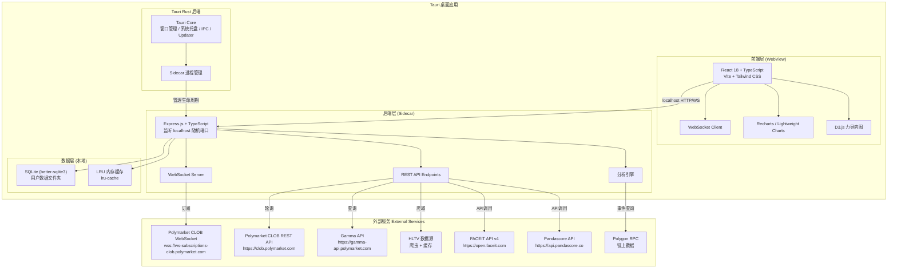
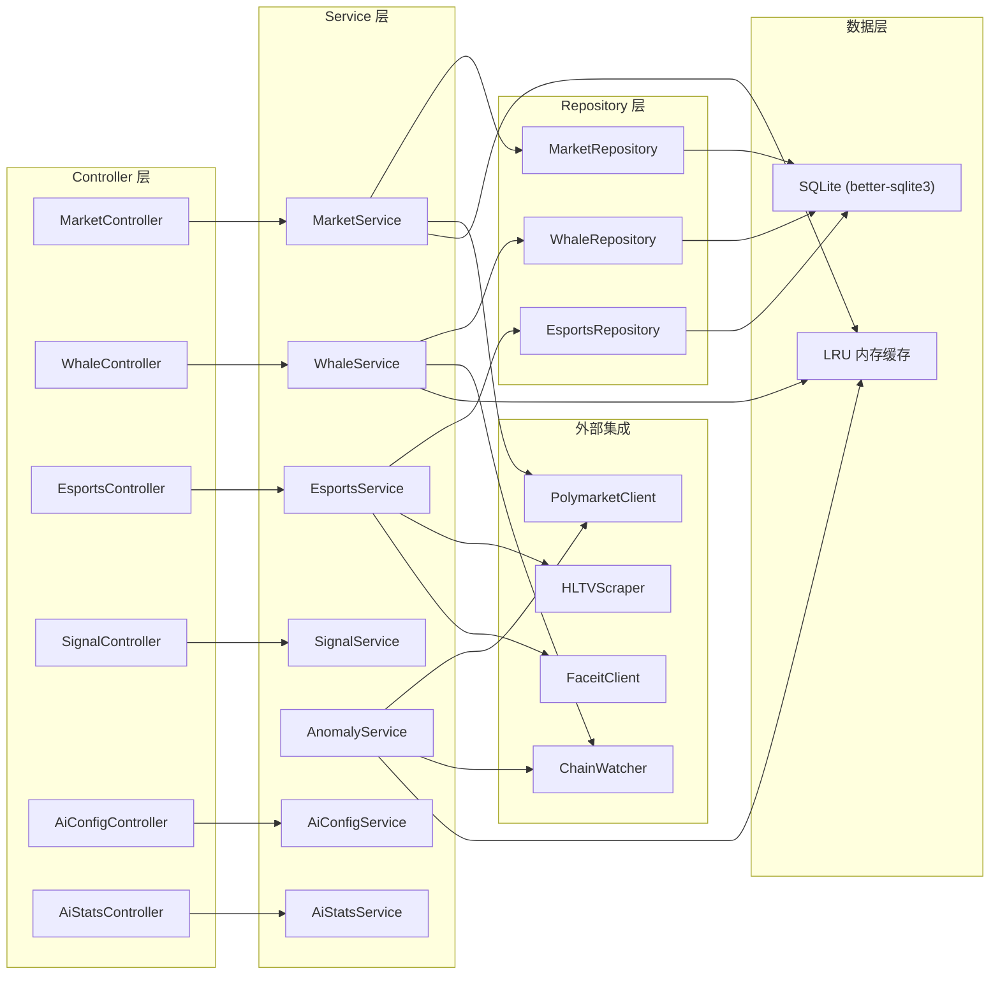
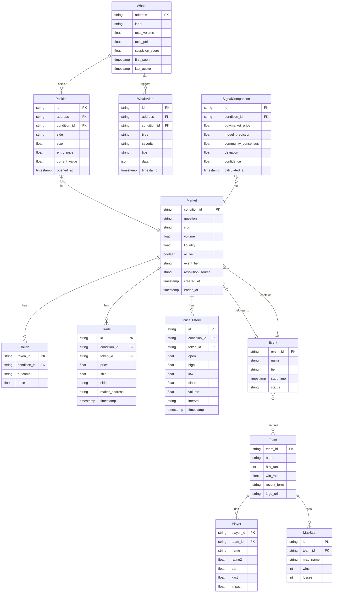
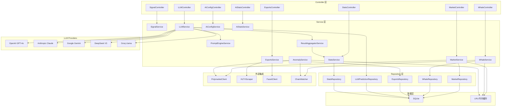

# PolyRader CS2 — 技术架构文档

## 1. 架构设计

PolyRader CS2 采用 **Tauri 桌面应用架构**：React 前端运行在 Tauri WebView 中，Express 后端作为 Tauri sidecar 进程运行，数据存储在用户本地文件夹。



## 2. 技术说明

| 层级 | 技术选型 | 说明 |
|------|----------|------|
| 桌面框架 | Tauri 2.x (Rust) | 跨平台桌面应用框架，WebView + Rust 后端 |
| 前端 | React 18 + TypeScript | SPA 应用，Vite 构建，运行在 Tauri WebView 中 |
| 样式 | Tailwind CSS 3 | 原子化 CSS，暗色主题 |
| 图表 | Recharts + Lightweight Charts | Recharts 用于统计图表，Lightweight Charts 用于 K 线图 |
| 图可视化 | D3.js | 力导向图用于地址关联图谱 |
| 状态管理 | Zustand | 轻量级全局状态管理 |
| 路由 | React Router DOM v6 (Hash) | Hash 路由，兼容 Tauri WebView file:// 协议 |
| 后端 | Express.js 4 + TypeScript | Tauri sidecar 进程，监听 localhost 随机端口 |
| 实时通信 | ws (WebSocket) | 前后端通过 localhost 双向实时通信 |
| 数据库 | SQLite (better-sqlite3) | 嵌入式数据库，零配置，存储在用户数据文件夹 |
| 缓存 | lru-cache (内存) | 进程内 LRU 缓存，替代 Redis |
| 链上交互 | ethers.js v6 | Polygon 链上事件查询 |
| 定时任务 | node-cron | 定期数据抓取与评分计算 |
| 打包分发 | Tauri Bundler | 生成 .dmg / .msi / .AppImage 安装包 |
| 更新机制 | Tauri Updater | 自动检测新版本并提示更新 |

## 3. 前端路由架构

### 3.1 路由方案

采用 React Router v6 hash-based 路由（`createHashRouter`），无 Tab 切换模式。Sidebar 导航驱动 URL 变化，面包屑显示路由层级。

### 3.2 路由表

| 路由路径 | 页面组件 | 所属模块 | 路由参数 |
|----------|---------|----------|----------|
| `/` | `DashboardPage` | Markets | — |
| `/daily` | `DailyPage` | Markets | — |
| `/match/:slug` | `MatchDetailPage` | Markets | slug: string |
| `/whales` | `WhalesPage` | Analysis | — |
| `/esports` | `EsportsPage` | Analysis | — |
| `/signals` | `SignalsPage` | Analysis | — |
| `/ai/config` | `AiConfigPage` | AI | — |
| `/ai/stats` | `AiStatsPage` | AI | — |

### 3.3 路由配置

```typescript
// src/router.tsx
import { createHashRouter } from "react-router-dom";

export const router = createHashRouter([
  {
    path: "/",
    element: <AppLayout />,
    children: [
      { index: true, element: <DashboardPage /> },
      { path: "daily", element: <DailyPage /> },
      { path: "match/:slug", element: <MatchDetailPage /> },
      { path: "whales", element: <WhalesPage /> },
      { path: "esports", element: <EsportsPage /> },
      { path: "signals", element: <SignalsPage /> },
      { path: "ai/config", element: <AiConfigPage /> },
      { path: "ai/stats", element: <AiStatsPage /> },
    ],
  },
]);
```

### 3.4 AppLayout 组件结构

```typescript
function AppLayout() {
  return (
    <div className="app flex h-screen">
      <Sidebar />           {/* 240px sidebar navigation */}
      <div className="flex-1 flex flex-col">
        <div className="flex-1 overflow-auto p-8">
          <Outlet />         {/* route content */}
        </div>
        <StatusBar />        {/* 28px status bar */}
      </div>
    </div>
  );
}
```

## 4. API 定义

### 4.1 市场数据 API

```typescript
// 获取 CS2 活跃市场列表
GET /api/markets
Query: { sport?: string; event_tier?: string; sort_by?: "volume" | "change" | "liquidity"; page?: number }
Response: {
  markets: Array<{
    condition_id: string;
    question: string;
    slug: string;
    tokens: Array<{ token_id: string; outcome: string; price: number }>;
    volume: number;
    liquidity: number;
    change_24h: number;
    event_tier: string;
    teams: [string, string];
    match_time: string;
    event_name: string;
  }>;
  total: number;
  page: number;
}

// 获取单个市场详情
GET /api/markets/:conditionId
Response: MarketDetail & {
  orderbook: { bids: OrderBookEntry[]; asks: OrderBookEntry[] };
  recent_trades: Trade[];
  whale_positions: WhalePosition[];
  signal: SignalComparison;
}

// 获取历史价格
GET /api/markets/:conditionId/prices
Query: { interval?: "1m" | "5m" | "1h" | "1d"; from?: string; to?: string }
Response: Array<{ timestamp: string; open: number; high: number; low: number; close: number; volume: number }>
```

### 4.2 巨鲸追踪 API

```typescript
// 获取大户排行
GET /api/whales
Query: { market_id?: string; sort_by?: "volume" | "pnl" | "suspicion"; limit?: number }
Response: Array<{
  address: string;
  label?: string;
  total_volume: number;
  total_pnl: number;
  suspicion_score: number;
  active_positions: Array<{ market: string; side: string; size: number; entry_price: number }>;
  last_active: string;
}>

// 获取地址详情
GET /api/whales/:address
Response: {
  address: string;
  suspicion_score: number;
  suspicion_breakdown: { timing: number; amount: number; frequency: number; correlation: number };
  position_history: PositionRecord[];
  trade_history: TradeRecord[];
  correlated_addresses: Array<{ address: string; correlation: number; flow: number }>;
  behavior_patterns: BehaviorPattern[];
}

// 获取异常告警
GET /api/alerts
Query: { type?: "whale" | "insider" | "anomaly"; severity?: "low" | "medium" | "high"; since?: string }
Response: Array<{
  id: string;
  type: string;
  severity: string;
  title: string;
  description: string;
  market_id: string;
  address?: string;
  timestamp: string;
  data: Record<string, unknown>;
}>
```

### 4.3 赛事分析 API

```typescript
// 获取 CS2 赛事列表
GET /api/esports/events
Query: { tier?: "S" | "A" | "B"; status?: "upcoming" | "live" | "completed"; page?: number }
Response: Array<{
  event_id: string;
  name: string;
  tier: string;
  start_time: string;
  teams: Array<TeamSummary>;
  polymarket_id?: string;
  status: string;
}>

// 获取战队数据
GET /api/esports/teams/:teamId
Response: {
  team_id: string;
  name: string;
  logo_url: string;
  hltv_rank: number;
  recent_form: string; // e.g. "WWLWL"
  win_rate: number;
  map_stats: Array<{ map: string; wins: number; losses: number; win_rate: number }>;
  players: Array<PlayerSummary>;
  head_to_head: Array<{ opponent: string; wins: number; losses: number }>;
}

// 获取预测信号
GET /api/signals/:marketId
Response: {
  market_id: string;
  polymarket_price: number;
  model_prediction: number;
  community_consensus: number;
  deviation: number;
  arbitrage_opportunities: Array<{
    type: string;
    profit_pct: number;
    description: string;
  }>;
  confidence: number;
  factors: Array<{ name: string; weight: number; direction: "bullish" | "bearish" | "neutral" }>;
}
```

### 4.4 WebSocket 事件定义

```typescript
// 客户端订阅
type ClientMessage =
  | { type: "subscribe"; channels: string[]; markets?: string[] }
  | { type: "unsubscribe"; channels: string[] }
  | { type: "ping" }

// 服务端推送
type ServerMessage =
  | { type: "price_update"; market_id: string; token_id: string; price: number; change: number; timestamp: string }
  | { type: "trade"; market_id: string; price: number; size: number; side: "BUY" | "SELL"; timestamp: string }
  | { type: "book_update"; market_id: string; bids: Array<[string, string]>; asks: Array<[string, string]>; timestamp: string }
  | { type: "whale_alert"; alert: AlertPayload }
  | { type: "anomaly"; market_id: string; score: number; description: string; timestamp: string }
  | { type: "pong" }
```

### 4.5 SSE 流式传输（LLM 分析结果）

除 WebSocket 外，服务端通过 SSE（Server-Sent Events）向前端单向流式推送 LLM 分析进度。SSE 与 WebSocket 的职责划分：

| 通道 | 方向 | 用途 |
|------|------|------|
| WebSocket | 双向（bidirectional） | 实时市场数据、巨鲸告警、异常推送等需要客户端订阅/取消订阅的场景 |
| SSE | 单向（server → client） | 流式推送 LLM 分析进度，每个 LLM 完成即推送，最终汇总后结束 |

**服务端**（`packages/server/src/sse.ts`）：

```typescript
// createSSEStream(res) 建立 text/event-stream 连接，返回流式写入器
export interface SSEStream {
  send(event: string, data: unknown): void;  // 推送命名事件
  done(): void;                               // 发送 done 事件并关闭
  error(message: string): void;               // 发送 error 事件并关闭
}
export function createSSEStream(res: Response): SSEStream;
```

**客户端**（`packages/web/src/utils/sse.ts`）：

```typescript
// parseSSEStream(response) 为异步生成器，逐个 yield { event, data }
export async function* parseSSEStream(
  response: Response,
): AsyncGenerator<{ event: string; data: string }>;

// streamAnalysis 封装完整流程：onProgress / onComplete / onError 回调
export async function streamAnalysis(
  url: string,
  body: Record<string, unknown>,
  callbacks: {
    onProgress?: (data: { provider: string; probability: number; confidence: number; reasoning: string }) => void;
    onComplete?: (data: { aggregation: unknown }) => void;
    onError?: (message: string) => void;
  },
): Promise<void>;
```

**接入点**：`AiConfigController.analyzeStream`（路由 `POST /api/ai/analyze/stream`）调用 `AiConfigService.analyzeWithProgress(matchId, teamAId, teamBId, onProgress)`：

1. 每个 LLM 完成时立即通过 `onProgress` 回调发送 `llm_result` 事件（含 `provider`、`probability`、`confidence`、`reasoning`、`error`）；
2. 全部 LLM 完成并聚合后，发送最终的 `result` 事件（含完整 `LLMAggregation`）；
3. 最后发送 `done` 事件关闭流；出错则发送 `error` 事件。

前端 `match-detail-page.tsx` 通过 `streamAnalysis` 消费该流，实时渲染每个 LLM 的预测结果，最终展示聚合结论。

## 5. 服务端架构图



## 6. 数据模型

### 6.1 数据模型定义



### 6.2 数据定义语言 (DDL) — SQLite

```sql
-- 市场表
CREATE TABLE markets (
    condition_id TEXT PRIMARY KEY,
    question TEXT NOT NULL,
    slug TEXT,
    volume REAL DEFAULT 0,
    liquidity REAL DEFAULT 0,
    active INTEGER DEFAULT 1,
    event_tier TEXT,
    resolution_source TEXT,
    event_name TEXT,
    match_time TEXT,
    created_at TEXT DEFAULT (datetime('now')),
    ended_at TEXT
);

CREATE INDEX idx_markets_active ON markets(active);
CREATE INDEX idx_markets_event_tier ON markets(event_tier);
CREATE INDEX idx_markets_volume ON markets(volume DESC);

-- 代币表
CREATE TABLE tokens (
    token_id TEXT PRIMARY KEY,
    condition_id TEXT REFERENCES markets(condition_id),
    outcome TEXT NOT NULL,
    price REAL DEFAULT 0
);

CREATE INDEX idx_tokens_condition ON tokens(condition_id);

-- 成交记录表
CREATE TABLE trades (
    id INTEGER PRIMARY KEY AUTOINCREMENT,
    condition_id TEXT REFERENCES markets(condition_id),
    token_id TEXT REFERENCES tokens(token_id),
    price REAL NOT NULL,
    size REAL NOT NULL,
    side TEXT NOT NULL,
    maker_address TEXT,
    timestamp TEXT NOT NULL
);

CREATE INDEX idx_trades_condition ON trades(condition_id);
CREATE INDEX idx_trades_timestamp ON trades(timestamp DESC);
CREATE INDEX idx_trades_address ON trades(maker_address);

-- 历史价格表
CREATE TABLE price_history (
    id INTEGER PRIMARY KEY AUTOINCREMENT,
    condition_id TEXT REFERENCES markets(condition_id),
    token_id TEXT REFERENCES tokens(token_id),
    open REAL,
    high REAL,
    low REAL,
    close REAL,
    volume REAL,
    interval TEXT NOT NULL,
    timestamp TEXT NOT NULL
);

CREATE INDEX idx_price_condition_time ON price_history(condition_id, timestamp DESC);

-- 赛事表
CREATE TABLE events (
    event_id TEXT PRIMARY KEY,
    name TEXT NOT NULL,
    tier TEXT,
    start_time TEXT,
    status TEXT DEFAULT 'upcoming'
);

-- 巨鲸表
CREATE TABLE whales (
    address TEXT PRIMARY KEY,
    label TEXT,
    total_volume REAL DEFAULT 0,
    total_pnl REAL DEFAULT 0,
    suspicion_score REAL DEFAULT 0,
    first_seen TEXT DEFAULT (datetime('now')),
    last_active TEXT DEFAULT (datetime('now'))
);

CREATE INDEX idx_whales_suspicion ON whales(suspicion_score DESC);
CREATE INDEX idx_whales_volume ON whales(total_volume DESC);

-- 持仓表
CREATE TABLE positions (
    id INTEGER PRIMARY KEY AUTOINCREMENT,
    address TEXT REFERENCES whales(address),
    condition_id TEXT REFERENCES markets(condition_id),
    side TEXT NOT NULL,
    size REAL NOT NULL,
    entry_price REAL,
    current_value REAL,
    opened_at TEXT DEFAULT (datetime('now'))
);

CREATE INDEX idx_positions_address ON positions(address);
CREATE INDEX idx_positions_market ON positions(condition_id);

-- 巨鲸告警表
CREATE TABLE whale_alerts (
    id INTEGER PRIMARY KEY AUTOINCREMENT,
    address TEXT REFERENCES whales(address),
    condition_id TEXT REFERENCES markets(condition_id),
    type TEXT NOT NULL,
    severity TEXT NOT NULL,
    title TEXT NOT NULL,
    data TEXT,
    timestamp TEXT DEFAULT (datetime('now'))
);

CREATE INDEX idx_alerts_severity ON whale_alerts(severity);
CREATE INDEX idx_alerts_timestamp ON whale_alerts(timestamp DESC);

-- 战队表
CREATE TABLE teams (
    team_id TEXT PRIMARY KEY,
    name TEXT NOT NULL,
    hltv_rank INTEGER,
    win_rate REAL,
    recent_form TEXT,
    logo_url TEXT,
    updated_at TEXT DEFAULT (datetime('now'))
);

-- 选手表
CREATE TABLE players (
    player_id TEXT PRIMARY KEY,
    team_id TEXT REFERENCES teams(team_id),
    name TEXT NOT NULL,
    rating2 REAL,
    adr REAL,
    kast REAL,
    impact REAL,
    updated_at TEXT DEFAULT (datetime('now'))
);

-- 地图统计表
CREATE TABLE map_stats (
    id INTEGER PRIMARY KEY AUTOINCREMENT,
    team_id TEXT REFERENCES teams(team_id),
    map_name TEXT NOT NULL,
    wins INTEGER DEFAULT 0,
    losses INTEGER DEFAULT 0
);

CREATE INDEX idx_mapstats_team ON map_stats(team_id);

-- 信号对比表
CREATE TABLE signal_comparisons (
    id INTEGER PRIMARY KEY AUTOINCREMENT,
    condition_id TEXT REFERENCES markets(condition_id),
    polymarket_price REAL,
    model_prediction REAL,
    community_consensus REAL,
    deviation REAL,
    confidence REAL,
    factors TEXT,
    calculated_at TEXT DEFAULT (datetime('now'))
);

CREATE INDEX idx_signal_market ON signal_comparisons(condition_id);
CREATE INDEX idx_signal_calculated ON signal_comparisons(calculated_at DESC);
```

## 7. 关键架构决策

### 7.1 实时数据流架构

```
Polymarket WebSocket → Express WS Server → LRU 内存缓存 → WebSocket 推送到前端
                                ↓
                        数据持久化到 SQLite
                                ↓
                        异常检测引擎处理
                                ↓
                        告警通过 EventEmitter 推送
```

- **数据入口**：后端通过 WebSocket 连接 Polymarket CLOB，订阅 `book` 和 `trade` 频道
- **数据分发**：收到的数据先写入 LRU 内存缓存，同时通过 Node.js EventEmitter 分发给各处理模块
- **前端推送**：Express WebSocket Server 监听 EventEmitter 事件，将数据实时推送到订阅的前端客户端
- **异常检测**：AnomalyService 订阅 EventEmitter，对每笔交易和订单簿变更进行实时评分

### 7.2 巨鲸识别与评分算法

**多维度评分体系**：

| 维度 | 权重 | 计算方法 |
|------|------|----------|
| 交易时机 | 30% | 事件确认前 N 小时内的交易集中度 Z-Score |
| 交易金额 | 25% | 单笔交易金额相对市场日均的倍数 |
| 交易频率 | 20% | 短时间窗口内的交易次数异常度 |
| 地址关联 | 25% | 关联地址集群的协同交易行为评分 |

**总分** = Σ(维度得分 × 权重)，分数范围 0-100，>70 标记为高可疑

### 7.3 预测模型设计

采用集成模型（Ensemble），融合以下信号源：

1. **HLTV 排名差值模型**：基于排名差异的胜率基线（权重 25%）
2. **近期状态模型**：近 30 天胜率加权（权重 20%）
3. **地图池匹配模型**：双方地图胜率的交叉分析（权重 20%）
4. **交锋记录模型**：历史对阵结果的时间衰减加权（权重 15%）
5. **市场情绪模型**：Polymarket 资金流向与价格动量（权重 20%）

### 7.4 数据更新频率

| 数据类型 | 更新方式 | 频率 |
|----------|----------|------|
| 订单簿 | WebSocket 实时推送 | 毫秒级 |
| 成交记录 | WebSocket 实时推送 | 毫秒级 |
| 市场价格 | WebSocket + REST 备用 | 秒级 |
| 巨鲸持仓 | 链上事件监听 | 分钟级 |
| HLTV 数据 | 定时爬虫 | 每小时 |
| FACEIT 数据 | API 轮询 | 每 30 分钟 |
| 预测信号 | 定时计算 | 每 15 分钟 |
| 异常评分 | 实时流式计算 | 实时 |

## 8. 预测模型数据获取路径明细

### 8.1 数据源 → 字段 → 预测因子映射表

| 预测因子 | 权重 | 数据源 | 获取方式 | 端点/URL | 关键字段 | 备注 |
|---------|------|--------|---------|---------|---------|------|
| HLTV 排名差值 | 25% | HLTV.org | 爬虫 | `hltv.org/ranking` | `team.name`, `team.rank`, `team.points` | 每周更新，取双方排名差查 Elo 转换表 |
| 近期状态 | 20% | HLTV.org | 爬虫 | `hltv.org/team/:id/matches` | `result(W/L)`, `opponent`, `date`, `event` | 近30天战绩，最近5场权重1.0，5-10场0.7 |
| 地图池匹配 | 20% | HLTV.org | 爬虫 | `hltv.org/stats/teams/maps?team=:id` | `map_name`, `win_rate`, `total_played` | 取双方每张地图胜率，模拟 BO3 ban/pick |
| 交锋记录 | 15% | HLTV.org | 爬虫 | `hltv.org/results?team=:idA&team=:idB` | `date`, `score`, `maps`, `event` | 时间衰减加权，近6个月权重1.0，6-12月0.5 |
| 市场情绪 | 20% | Polymarket | WebSocket + REST | CLOB WS + Gamma API | `price`, `volume`, `order_book`, `trades` | 实时价格、24h资金流、大单方向 |
| 选手因子(扩展) | — | HLTV.org | 爬虫 | `hltv.org/player/:id` | `rating2.0`, `adr`, `kast`, `impact` | 选手个人数据，用于阵容变动修正 |
| 选手因子(备用) | — | FACEIT API | REST | `open.faceit.com/data/v4/players/:id/stats/cs2` | `average_kd`, `win_rate`, `matches` | HLTV 爬虫不可用时的备用方案 |
| 赛事数据(备用) | — | Pandascore API | REST | `api.pandascore.co/csgo/matches` | `winner`, `score`, `maps`, `players` | 付费 API，数据质量高但成本较高 |

### 8.2 HLTV 爬虫设计

```
HLTV 数据源结构：

hltv.org/ranking                          → 世界排名 Top 50 列表
hltv.org/team/:id/:slug                   → 战队详情页（排名、近期战绩、地图胜率）
hltv.org/stats/teams/maps?team=:id        → 战队地图统计（每张地图的胜率、场次）
hltv.org/results?team=:id                 → 战队历史比赛结果
hltv.org/matches/:id/:slug                → 单场比赛详情（地图比分、选手数据）
hltv.org/player/:id/:slug                 → 选手个人数据（rating、ADR、KAST、Impact）
hltv.org/events/:id/:slug                 → 赛事信息（赛程、参赛队伍、奖金池）
```

**反爬策略**：
- HLTV 使用 Cloudflare 保护，需配置 Residential Proxy
- 请求间隔 ≥ 3 秒，避免触发速率限制
- User-Agent 伪装为常见浏览器
- 优先使用 Apify 的 HLTV Actor（已封装好爬虫逻辑）作为主方案
- 自建爬虫使用 Puppeteer/Playwright 处理 JS 渲染

**数据缓存策略**：
- 排名数据：LRU 内存缓存 1 小时
- 战队/选手数据：LRU 内存缓存 6 小时
- 历史比赛结果：SQLite 持久化，增量更新
- 赛前 1 小时自动刷新相关战队所有数据

### 8.3 备用数据源切换逻辑

```
优先级链：
  HLTV 爬虫（主） → FACEIT API（备用） → Pandascore API（兜底）

切换条件：
  - HLTV 爬虫连续 3 次失败 → 降级到 FACEIT API
  - FACEIT API 返回 429/5xx → 降级到 Pandascore API
  - 所有数据源不可用 → 仅使用市场情绪模型（权重提升至 100%）

数据字段映射（降级时）：
  HLTV ranking  → FACEIT: /rankings/cs2/teams?region=EU
  HLTV matches  → FACEIT: /data/v4/teams/:id/stats/cs2
  HLTV maps     → Pandascore: /csgo/matches/:id/games
```

## 9. Polymarket API 可获取数据全景

### 9.1 三层 API 架构

Polymarket 提供三套独立的 API，各有不同的用途和认证要求：

| API | 用途 | 认证 | Base URL |
|-----|------|------|----------|
| **Gamma API** | 市场发现、元数据、事件查询 | 无需认证 | `gamma-api.polymarket.com` |
| **CLOB API** | 订单簿、交易下单、持仓管理 | 钱包签名认证 | `clob.polymarket.com` |
| **Data API** | 历史活动、地址画像、时间序列 | 无需认证 | `data-api.polymarket.com` |

### 9.2 Gamma API — 市场数据（无需认证）

| 端点 | 方法 | 用途 | 关键返回字段 |
|------|------|------|-------------|
| `/events` | GET | 获取事件列表（含关联市场） | `id`, `title`, `slug`, `tags`, `markets[].question`, `markets[].outcomePrices`, `markets[].volume`, `markets[].liquidity`, `markets[].clobTokenIds` |
| `/events?tag_id=:id&active=true&closed=false` | GET | 按标签筛选活跃事件 | 同上，支持 `order=volume_24hr` 排序 |
| `/events/slug/:slug` | GET | 按 slug 获取单个事件 | 完整事件 + 所有关联市场 |
| `/markets` | GET | 获取市场列表 | `conditionId`, `question`, `outcomes`, `outcomePrices`, `volume`, `liquidity`, `closed`, `endDate` |
| `/markets?slug=:slug` | GET | 按 slug 获取单个市场 | 同上 + `description`, `clobTokenIds`, `rewards` |
| `/sports` | GET | 获取体育赛事标签列表 | `id`, `label`, `slug`, `series[]` |
| `/tags` | GET | 获取所有分类标签 | `id`, `label`, `slug` |

**本工具使用场景**：
- 通过 `/sports` 发现 CS2 相关标签 → 用 `tag_id` 筛选 CS2 市场
- 通过 `/events` 获取所有活跃 CS2 事件 → 解析 `outcomePrices` 获取当前市场价格
- 通过 `clobTokenIds` 获取 token_id → 用于后续 CLOB API 查询

### 9.3 CLOB API — 订单簿与交易（钱包认证）

**公开端点（无需认证）**：

| 端点 | 方法 | 用途 | 关键返回字段 |
|------|------|------|-------------|
| `/book?token_id=:id` | GET | 获取完整订单簿 | `bids[{price, size}]`, `asks[{price, size}]`, `spread`, `midpoint` |
| `/price?token_id=:id&side=buy` | GET | 获取最优报价 | `price`（买一或卖一价） |
| `/trades?market=:conditionId` | GET | 获取最近成交记录 | `price`, `size`, `side`, `timestamp`, `maker_address` |
| `/prices-history?market=:conditionId` | GET | 获取历史价格序列 | `t`, `o`, `h`, `l`, `c`, `v`（OHLCV 格式） |

**认证端点（需钱包签名）**：

| 端点 | 方法 | 用途 |
|------|------|------|
| `/order` | POST | 下单（限价单/市价单） |
| `/order/:id` | DELETE | 撤单 |
| `/orders` | GET | 查询当前挂单 |
| `/balance-allowance` | GET | 查询余额和授权额度 |

**本工具使用场景**：
- 公开端点用于获取实时订单簿深度、成交记录、历史价格
- 认证端点用于程序化下单（详见第 10 节）

### 9.4 CLOB WebSocket — 实时数据流

**两个频道**：

| 频道 | 端点 | 认证 | 用途 |
|------|------|------|------|
| Market Channel | `wss://ws-subscriptions-clob.polymarket.com/ws/market` | 无需认证 | 订单簿实时更新、价格变动、成交推送 |
| User Channel | `wss://ws-subscriptions-clob.polymarket.com/ws/user` | 钱包签名 | 用户订单状态、成交回报、持仓更新 |

**Market Channel 消息类型**：

| event_type | 描述 | 关键字段 |
|-----------|------|---------|
| `book` | 全量订单簿快照 | `asset_id`, `bids[{price, size}]`, `asks[{price, size}]`, `timestamp` |
| `price_change` | 增量价格变动 | `price_changes[{asset_id, best_bid, best_ask, changes}]` |
| `last_trade_price` | 最新成交价 | `asset_id`, `price`, `size`, `side`, `timestamp` |

**订阅方式**：
```json
{ "assets_ids": ["token_id_1", "token_id_2"], "type": "market" }
```
每个连接最多订阅 500 个资产。需每 10 秒发送 `PING` 保持连接。

### 9.5 Data API — 历史数据与地址分析

| 端点 | 方法 | 用途 | 关键返回字段 |
|------|------|------|-------------|
| `/activity` | GET | 全局活动流 | 最新交易、市场创建等事件 |
| `/activity/:address` | GET | 指定地址的活动历史 | 该地址的所有交易记录 |
| `/positions/:address` | GET | 指定地址的当前持仓 | `token_id`, `size`, `avg_price`, `pnl` |
| `/time-series/:tokenId` | GET | 代币历史价格序列 | 时间序列 OHLCV 数据 |

**本工具使用场景**：
- `/activity/:address` 用于巨鲸地址行为分析
- `/positions/:address` 用于巨鲸当前持仓追踪
- `/time-series/:tokenId` 用于价格走势图绘制

### 9.6 链上数据（Polygon RPC）

所有 Polymarket 交易最终在 Polygon 链上结算，可通过 RPC 节点获取：

| 数据类型 | 合约 | 事件 |
|---------|------|------|
| 成交记录 | CTF Exchange (`0x4bFb41d5...`) | `OrderFilled(maker, taker, tokenId, price, amount)` |
| 持仓拆分 | CTF (`0x4D97DCd9...`) | `PositionSplit(stakeholder, collateralToken, conditionId, partition)` |
| 持仓合并 | CTF | `PositionMerge(stakeholder, collateralToken, conditionId, partition)` |
| 赎回结算 | CTF | `PayoutRedemption(redeemer, conditionId, payout)` |

**本工具使用场景**：
- 链上事件监听用于巨鲸追踪（无需依赖 Polymarket API）
- 地址聚类分析（关联地址协同行为检测）
- 跨平台数据验证（对比链上数据与 API 数据的一致性）

## 11. 多 LLM 编排层

### 11.1 架构概览

```
┌─────────────────────────────────────────────────────────────────┐
│                      LLM Orchestration Layer                      │
│                                                                   │
│  ┌─────────────┐  ┌─────────────┐  ┌─────────────┐  ┌─────────┐ │
│  │ PromptEngine │  │ LLMRegistry  │  │ ResultAggr  │  │ Stats   │ │
│  │ 提示词引擎    │  │ LLM 注册中心  │  │ 结果聚合器   │  │ 统计引擎 │ │
│  └──────┬───────┘  └──────┬──────┘  └──────┬──────┘  └────┬────┘ │
│         │                 │                │              │       │
│  ┌──────┴─────────────────┴────────────────┴──────────────┴─────┐ │
│  │                    LLM Providers                              │ │
│  │  ┌────────┐ ┌────────┐ ┌────────┐ ┌────────┐ ┌────────┐     │ │
│  │  │OpenAI  │ │Anthropic│ │ Google │ │DeepSeek│ │ Groq   │ ... │ │
│  │  │GPT-4o  │ │Claude  │ │Gemini  │ │ V3     │ │Llama   │     │ │
│  │  └────────┘ └────────┘ └────────┘ └────────┘ └────────┘     │ │
│  └──────────────────────────────────────────────────────────────┘ │
└─────────────────────────────────────────────────────────────────┘
```

### 11.2 LLM Provider 接口

```typescript
// LLM Provider 统一接口
interface LLMProvider {
  id: string;                    // "openai-gpt4o", "anthropic-claude35", etc.
  name: string;                  // "GPT-4o", "Claude 3.5 Sonnet"
  provider: string;              // "openai", "anthropic", "google", "deepseek", "groq"
  enabled: boolean;              // 用户是否启用
  defaultModel: string;          // "gpt-4o", "claude-3-5-sonnet-20241022", etc.
  
  analyze(matchData: MatchData, prompt: PromptTemplate): Promise<LLMResult>;
  getStatus(): Promise<ProviderStatus>;
}

interface LLMResult {
  providerId: string;
  model: string;
  winner: string;                // 预测胜者
  confidence: number;            // 置信度 0-100
  reasoning: string;             // 推理过程
  keyFactors: string[];          // 关键因素
  riskFactors: string[];         // 风险因素
  recommendedAction: "BUY" | "SELL" | "HOLD";
  latency: number;               // 响应时间 ms
  tokensUsed: number;            // Token 消耗
  cost: number;                  // 费用 USD
  rawResponse: string;           // 原始响应
  timestamp: string;
}
```

### 11.3 LLM 注册中心

```typescript
class LLMRegistry {
  private providers: Map<string, LLMProvider> = new Map();
  
  // 注册 LLM Provider
  register(provider: LLMProvider): void;
  
  // 获取启用的 Provider 列表
  getEnabledProviders(): LLMProvider[];
  
  // 并行调用所有启用的 LLM
  async analyzeAll(matchData: MatchData, prompt: PromptTemplate): Promise<LLMResult[]> {
    const providers = this.getEnabledProviders();
    const results = await Promise.allSettled(
      providers.map(p => p.analyze(matchData, prompt))
    );
    // 过滤失败的调用，记录错误日志
    return results
      .filter(r => r.status === 'fulfilled')
      .map(r => (r as PromiseFulfilledResult<LLMResult>).value);
  }
  
  // 获取各 Provider 状态
  async getStatuses(): Promise<Map<string, ProviderStatus>>;
}
```

### 11.4 并行调用策略

```
┌─────────────────────────────────────────────────────┐
│  ParallelInvoker                                     │
│                                                      │
│  matchData ──┬── GPT-4o ──────┐                     │
│              ├── Claude ──────┤                     │
│              ├── Gemini ──────┼── Promise.allSettled │
│              ├── DeepSeek ────┤        │             │
│              └── Grok ────────┘        ▼             │
│                                  ResultAggregator    │
│                                                      │
│  超时控制: 每个 LLM 30s 超时                          │
│  重试策略: 失败自动重试 1 次                           │
│  降级策略: 至少 1 个 LLM 成功即可返回结果              │
└─────────────────────────────────────────────────────┘
```

## 12. 提示词工程层

### 12.1 提示词模板系统

```typescript
// 提示词模板定义
interface PromptTemplate {
  id: string;
  name: string;
  version: string;
  
  // 四层提示词结构
  systemPrompt: string;          // Layer 1: 角色定义
  contextTemplate: string;       // Layer 2: 上下文模板
  dataSchema: DataField[];       // Layer 3: 数据注入字段定义
  outputSchema: OutputSchema;    // Layer 4: 输出约束
  
  // 模板变量
  variables: PromptVariable[];
}

interface DataField {
  name: string;                  // 字段名
  source: "hltv" | "polymarket" | "chain" | "faceit";
  path: string;                  // 数据路径，如 "teams[0].rank"
  required: boolean;
  defaultValue?: unknown;
}

interface OutputSchema {
  format: "json";                // 强制 JSON 输出
  schema: Record<string, { type: string; description: string }>;
  example: Record<string, unknown>;
}

interface PromptVariable {
  name: string;
  description: string;
  defaultValue?: string;
}
```

### 12.2 提示词渲染引擎

```typescript
class PromptEngine {
  private templates: Map<string, PromptTemplate> = new Map();
  
  // 注册提示词模板
  registerTemplate(template: PromptTemplate): void;
  
  // 渲染提示词
  render(templateId: string, matchData: MatchData): RenderedPrompt {
    const template = this.templates.get(templateId);
    
    // Layer 1: System Prompt（直接使用）
    const systemPrompt = template.systemPrompt;
    
    // Layer 2: Context Template（注入比赛上下文）
    const context = this.renderContext(template.contextTemplate, matchData);
    
    // Layer 3: Data Injection（采集并格式化数据）
    const dataBlock = this.collectAndFormatData(template.dataSchema, matchData);
    
    // Layer 4: Output Schema（追加到 System Prompt）
    const outputConstraint = this.renderOutputSchema(template.outputSchema);
    
    return {
      systemPrompt: `${systemPrompt}\n\n${outputConstraint}`,
      userPrompt: `${context}\n\n${dataBlock}`,
    };
  }
  
  // 数据采集与格式化
  private collectAndFormatData(fields: DataField[], matchData: MatchData): string {
    const collected: Record<string, unknown> = {};
    for (const field of fields) {
      const value = this.resolveDataPath(field.source, field.path, matchData);
      if (value !== undefined) {
        collected[field.name] = value;
      } else if (field.required) {
        throw new Error(`Required field ${field.name} not found`);
      }
    }
    return this.formatAsMarkdownTable(collected);
  }
}
```

### 12.3 提示词模板版本管理

```
prompts/
├── cs2-match-analysis/
│   ├── v1.0.0.yaml          # 初始版本
│   ├── v1.1.0.yaml          # 增加选手数据字段
│   └── v2.0.0.yaml          # 增加巨鲸动向 + 市场情绪
├── cs2-map-analysis/
│   └── v1.0.0.yaml
└── cs2-player-analysis/
    └── v1.0.0.yaml
```

每个模板 YAML 文件包含完整的四层提示词定义，支持版本迭代和 A/B 测试。

### 12.4 提示词 A/B 测试

```typescript
interface ABTest {
  id: string;
  templateId: string;
  variants: {
    variantA: { templateVersion: string; weight: number };
    variantB: { templateVersion: string; weight: number };
  };
  metrics: ("accuracy" | "confidence_calibration" | "latency")[];
  startDate: string;
  endDate?: string;
}
```

> **当前状态：已规划但未实现。** `PromptEngine` 当前从 `prompts/` 目录加载单一模板集（system / context-template / output-schema），无变体选择与流量分配逻辑。上述 `ABTest` 接口仅为设计预留，待后续迭代实现。

## 13. 结果聚合层

### 13.1 聚合算法实现

```typescript
class ResultAggregator {
  // 聚合多个 LLM 结果
  aggregate(results: LLMResult[], llmStats: LLMStats[]): AggregatedResult {
    // Step 1: 投票统计
    const votes = this.countVotes(results);
    
    // Step 2: 加权置信度（基于历史准确率）
    const weightedConfidence = this.calculateWeightedConfidence(results, llmStats);
    
    // Step 3: 共识度检测
    const consensusLevel = this.detectConsensus(votes, results.length);
    
    // Step 4: 生成聚合结果
    return {
      consensusWinner: votes.leading,
      consensusPct: votes.leadingPct,
      voteDistribution: votes.distribution,
      consensusLevel,
      weightedConfidence,
      individualResults: results,
      marketComparison: null, // 后续填充
    };
  }
  
  private countVotes(results: LLMResult[]): VoteResult {
    const distribution: Record<string, number> = {};
    for (const r of results) {
      distribution[r.winner] = (distribution[r.winner] || 0) + 1;
    }
    const leading = Object.entries(distribution)
      .sort(([,a], [,b]) => b - a)[0];
    return {
      distribution,
      leading: leading[0],
      leadingPct: leading[1] / results.length,
    };
  }
  
  private detectConsensus(votes: VoteResult, total: number): "high" | "medium" | "low" {
    if (votes.leadingPct === 1.0) return "high";
    if (votes.leadingPct >= 0.75) return "medium";
    return "low";
  }
}
```

### 13.2 聚合结果数据结构

```typescript
interface AggregatedResult {
  consensusWinner: string;
  consensusPct: number;
  voteDistribution: Record<string, number>;
  consensusLevel: "high" | "medium" | "low";
  weightedConfidence: number;
  individualResults: LLMResult[];
  marketComparison: {
    polymarketPrice: number;
    deviation: number;
    signal: "BUY" | "SELL" | "HOLD";
  } | null;
}
```

## 14. 胜率统计层

### 14.1 统计引擎

```typescript
class StatsEngine {
  // 更新 LLM 统计（赛后调用）
  async updateLLMStats(predictionId: string, actualWinner: string): Promise<void> {
    const record = await this.getPredictionRecord(predictionId);
    
    for (const llmResult of record.llmResults) {
      const isCorrect = llmResult.winner === actualWinner;
      await this.incrementLLMStats(llmResult.providerId, {
        total: 1,
        correct: isCorrect ? 1 : 0,
        confidenceDelta: isCorrect 
          ? llmResult.confidence - 50  // 预测正确时，高置信度是好的
          : 50 - llmResult.confidence,  // 预测错误时，高置信度是坏的
      });
    }
    
    // 更新共识统计
    if (record.llmConsensus) {
      const consensusCorrect = record.llmConsensus.consensusWinner === actualWinner;
      await this.incrementConsensusStats({
        total: 1,
        correct: consensusCorrect ? 1 : 0,
        level: record.llmConsensus.consensusLevel,
      });
    }
    
    // 更新用户统计
    if (record.userAction !== 'skip') {
      const userCorrect = record.userPrediction === actualWinner;
      await this.incrementUserStats({
        total: 1,
        correct: userCorrect ? 1 : 0,
      });
    }
  }
  
  // 获取 LLM 排行榜
  async getLLMLeaderboard(): Promise<LLMStats[]> {
    // 按准确率排序
  }
  
  // 获取用户统计
  async getUserStats(): Promise<UserStats> {
    return {
      totalPredictions: number;
      correctPredictions: number;
      accuracy: number;
      totalOrders: number;
      totalPnL: number;
      sharpeRatio: number;
      vsLLMConsensus: number;  // 用户准确率 - LLM 共识准确率
    };
  }
  
  // 获取置信度校准数据
  async getCalibrationData(providerId: string): Promise<CalibrationPoint[]> {
    // 返回 { confidence, actualWinRate } 数据点用于绘制校准曲线
  }
}
```

### 14.2 统计 API

```typescript
// LLM 排行榜
GET /api/stats/llm-leaderboard
Response: Array<{
  providerId: string;
  name: string;
  totalPredictions: number;
  correctPredictions: number;
  accuracy: number;
  avgConfidence: number;
  calibrationError: number;  // 置信度校准误差
  avgLatency: number;
  totalCost: number;
}>

// 用户统计
GET /api/stats/user
Response: {
  totalPredictions: number;
  correctPredictions: number;
  accuracy: number;
  totalOrders: number;
  totalPnL: number;
  sharpeRatio: number;
  vsLLMConsensus: number;
  recentTrend: Array<{ date: string; accuracy: number }>;
}

// 预测历史
GET /api/stats/predictions
Query: { page?: number; limit?: number; status?: "pending" | "resolved" }
Response: {
  predictions: Array<{
    id: string;
    matchName: string;
    marketId: string;
    llmConsensus: { winner: string; pct: number };
    userPrediction: string | null;
    userAction: "confirm" | "adjust" | "skip";
    actualResult: string | null;
    isCorrect: boolean | null;
    createdAt: string;
    resolvedAt: string | null;
  }>;
  total: number;
}

// 置信度校准
GET /api/stats/calibration/:providerId
Response: Array<{
  confidenceBucket: string;  // "0-10", "10-20", ..., "90-100"
  count: number;
  actualWinRate: number;
}>
```

### 14.3 数据模型扩展

```sql
-- LLM 预测记录表
CREATE TABLE llm_predictions (
    id INTEGER PRIMARY KEY AUTOINCREMENT,
    match_id VARCHAR(100) NOT NULL,
    market_id VARCHAR(66) REFERENCES markets(condition_id),
    match_data TEXT NOT NULL,           -- 采集的比赛数据快照（JSON）
    llm_results TEXT NOT NULL,          -- 各 LLM 的预测结果（JSON）
    llm_consensus TEXT,                 -- LLM 共识结果（JSON）
    user_prediction VARCHAR(50),         -- 用户最终预测
    user_action VARCHAR(20),             -- confirm / adjust / skip
    order_executed BOOLEAN DEFAULT false,
    order_details TEXT,                 -- 下单详情（JSON）
    actual_result VARCHAR(50),           -- 实际比赛结果
    created_at TEXT DEFAULT (datetime('now')),
    resolved_at TEXT
);

CREATE INDEX idx_llm_pred_match ON llm_predictions(match_id);
CREATE INDEX idx_llm_pred_created ON llm_predictions(created_at DESC);
CREATE INDEX idx_llm_pred_resolved ON llm_predictions(resolved_at);

-- LLM 统计表
CREATE TABLE llm_stats (
    provider_id VARCHAR(50) PRIMARY KEY,
    name VARCHAR(100) NOT NULL,
    total_predictions INT DEFAULT 0,
    correct_predictions INT DEFAULT 0,
    accuracy DECIMAL(5, 4) DEFAULT 0,
    avg_confidence DECIMAL(5, 2) DEFAULT 0,
    calibration_error DECIMAL(8, 4) DEFAULT 0,
    total_latency_ms INTEGER DEFAULT 0,
    total_cost DECIMAL(10, 6) DEFAULT 0,
    updated_at TEXT DEFAULT (datetime('now'))
);

-- LLM 共识统计表
CREATE TABLE consensus_stats (
    id INTEGER PRIMARY KEY AUTOINCREMENT,
    consensus_level VARCHAR(10) NOT NULL,  -- high / medium / low
    total_predictions INT DEFAULT 0,
    correct_predictions INT DEFAULT 0,
    accuracy DECIMAL(5, 4) DEFAULT 0,
    updated_at TEXT DEFAULT (datetime('now'))
);

-- 用户统计表
CREATE TABLE user_stats (
    id INTEGER PRIMARY KEY AUTOINCREMENT,
    total_predictions INT DEFAULT 0,
    correct_predictions INT DEFAULT 0,
    accuracy DECIMAL(5, 4) DEFAULT 0,
    total_orders INT DEFAULT 0,
    total_pnl DECIMAL(18, 6) DEFAULT 0,
    sharpe_ratio DECIMAL(8, 4) DEFAULT 0,
    updated_at TEXT DEFAULT (datetime('now'))
);

-- 置信度校准数据表
CREATE TABLE calibration_data (
    id INTEGER PRIMARY KEY AUTOINCREMENT,
    provider_id VARCHAR(50) NOT NULL,
    confidence_bucket VARCHAR(10) NOT NULL,  -- "0-10", "10-20", ...
    count INT DEFAULT 0,
    correct INT DEFAULT 0,
    actual_win_rate DECIMAL(5, 4) DEFAULT 0,
    updated_at TEXT DEFAULT (datetime('now'))
);

CREATE INDEX idx_calibration_provider ON calibration_data(provider_id);
```

## 15. 更新后的服务端架构图



## 16. 完整路由清单（合并）

以下为前后端所有路由的完整清单：

| 路由 | 类型 | 页面组件 | 说明 |
|------|------|---------|------|
| `/` | 前端 | `DashboardPage` | 市场总览仪表板 |
| `/daily` | 前端 | `DailyPage` | 每日看板 |
| `/match/:slug` | 前端 | `MatchDetailPage` | 比赛分析 |
| `/whales` | 前端 | `WhalesPage` | 巨鲸追踪 |
| `/esports` | 前端 | `EsportsPage` | 赛事分析 |
| `/signals` | 前端 | `SignalsPage` | 信号对比 |
| `/ai/config` | 前端 | `AiConfigPage` | AI 配置 |
| `/ai/stats` | 前端 | `AiStatsPage` | AI 胜率统计 |

## 17. 新增 API 定义

### 17.1 LLM 分析 API

```typescript
// 触发 LLM 分析
POST /api/llm/analyze
Body: {
  matchId: string;
  marketId?: string;
  providers?: string[];  // 指定 LLM，默认全部启用
}
Response: {
  analysisId: string;
  status: "running" | "completed";
  estimatedTime: number;  // 预计完成时间 ms
}

// 获取分析结果
GET /api/llm/analysis/:analysisId
Response: {
  analysisId: string;
  status: "running" | "completed" | "failed";
  matchData: MatchData;
  results: LLMResult[];
  aggregated: AggregatedResult;
  marketComparison: {
    polymarketPrice: number;
    deviation: number;
    signal: "BUY" | "SELL" | "HOLD";
  } | null;
}

// 获取 LLM Provider 状态
GET /api/llm/providers
Response: Array<{
  id: string;
  name: string;
  enabled: boolean;
  status: "online" | "offline" | "rate_limited";
  avgLatency: number;
  monthlyCost: number;
}>

// 更新 LLM Provider 配置
PUT /api/llm/providers/:providerId
Body: {
  enabled?: boolean;
  apiKey?: string;
  model?: string;
}
```

### 17.2 用户决策 API

```typescript
// 用户确认或调整预测
POST /api/llm/analysis/:analysisId/decide
Body: {
  action: "confirm" | "adjust" | "skip";
  userPrediction?: string;      // adjust 时必填
  userConfidence?: number;      // adjust 时选填
  executeOrder?: boolean;       // 是否同时下单
  orderDetails?: {
    marketId: string;
    side: "BUY" | "SELL";
    size: number;
    price?: number;             // 限价单价格，不填则市价
  };
}
Response: {
  decisionId: string;
  action: string;
  orderExecuted: boolean;
  orderId?: string;
}
```

## 18. 投注模拟与统计引擎

### 18.1 模拟投注引擎

```typescript
class SimulatedBettingEngine {
  // 每次 LLM 分析后自动生成模拟投注
  async generateSimulatedBet(llmResult: LLMResult, marketPrice: number): Promise<SimulatedBet> {
    if (llmResult.recommendedAction === 'HOLD') return null;
    
    const betAmount = 100; // 固定模拟投注额 100 USDC
    const side = llmResult.recommendedAction === 'BUY' ? 'BUY' : 'SELL';
    
    return {
      id: generateId(),
      providerId: llmResult.providerId,
      matchId: llmResult.matchId,
      marketId: llmResult.marketId,
      predictedWinner: llmResult.winner,
      side,
      amount: betAmount,
      entryPrice: marketPrice,
      confidence: llmResult.confidence,
      status: 'pending',
      createdAt: new Date().toISOString(),
    };
  }
  
  // 赛后结算
  async settleBet(bet: SimulatedBet, actualWinner: string): Promise<SettledBet> {
    const isCorrect = bet.predictedWinner === actualWinner;
    let pnl = 0;
    
    if (isCorrect) {
      if (bet.side === 'BUY') {
        // 买入 Yes，正确时盈利 = 投入 × (1/买入价 - 1)
        pnl = bet.amount * (1 / bet.entryPrice - 1);
      } else {
        // 卖出 Yes（即买入 No），正确时盈利 = 投入 × (1/(1-买入价) - 1)
        pnl = bet.amount * (1 / (1 - bet.entryPrice) - 1);
      }
    } else {
      pnl = -bet.amount; // 全额亏损
    }
    
    return {
      ...bet,
      status: 'settled',
      isCorrect,
      pnl: Math.round(pnl * 100) / 100,
      settledAt: new Date().toISOString(),
    };
  }
}
```

### 18.2 统计计算引擎

```typescript
class BettingStatsEngine {
  // 计算 LLM 统计指标
  async calculateLLMStats(providerId: string, timeWindow?: string): Promise<LLMBettingStats> {
    const bets = await this.getSettledBets(providerId, timeWindow);
    
    const total = bets.length;
    const correct = bets.filter(b => b.isCorrect).length;
    const accuracy = total > 0 ? correct / total : 0;
    
    // ROI
    const totalInvested = bets.reduce((sum, b) => sum + b.amount, 0);
    const totalPnl = bets.reduce((sum, b) => sum + b.pnl, 0);
    const roi = totalInvested > 0 ? totalPnl / totalInvested : 0;
    
    // 夏普比率
    const returns = bets.map(b => b.pnl / b.amount);
    const avgReturn = returns.reduce((a, b) => a + b, 0) / returns.length;
    const stdDev = Math.sqrt(
      returns.reduce((sum, r) => sum + Math.pow(r - avgReturn, 2), 0) / returns.length
    );
    const sharpeRatio = stdDev > 0 ? (avgReturn / stdDev) * Math.sqrt(252) : 0;
    
    // 最大回撤
    const maxDrawdown = this.calculateMaxDrawdown(bets);
    
    return { providerId, total, correct, accuracy, roi, sharpeRatio, maxDrawdown, totalPnl };
  }
  
  // 计算最大回撤
  private calculateMaxDrawdown(bets: SettledBet[]): number {
    let peak = 0;
    let maxDrawdown = 0;
    let cumulativePnl = 0;
    
    for (const bet of bets) {
      cumulativePnl += bet.pnl;
      if (cumulativePnl > peak) peak = cumulativePnl;
      const drawdown = peak - cumulativePnl;
      if (drawdown > maxDrawdown) maxDrawdown = drawdown;
    }
    
    return maxDrawdown;
  }
  
  // 计算用户统计
  async calculateUserStats(): Promise<UserBettingStats> {
    const predictions = await this.getUserPredictions();
    const total = predictions.filter(p => p.userAction !== 'skip').length;
    const correct = predictions.filter(p => p.isCorrect).length;
    const accuracy = total > 0 ? correct / total : 0;
    
    const orders = predictions.filter(p => p.orderExecuted);
    const totalPnl = orders.reduce((sum, o) => sum + (o.orderDetails?.pnl || 0), 0);
    const totalInvested = orders.reduce((sum, o) => sum + (o.orderDetails?.amount || 0), 0);
    const roi = totalInvested > 0 ? totalPnl / totalInvested : 0;
    
    // vs LLM 共识
    const consensusCorrect = predictions.filter(
      p => p.llmConsensus?.consensusWinner === p.actualResult
    ).length;
    const consensusAccuracy = predictions.length > 0 
      ? consensusCorrect / predictions.length : 0;
    const vsLLM = accuracy - consensusAccuracy;
    
    return { totalPredictions: total, correctPredictions: correct, accuracy, 
             totalOrders: orders.length, totalPnl, roi, vsLLM };
  }
  
  // 置信度校准计算
  async calculateCalibration(providerId: string): Promise<CalibrationData[]> {
    const bets = await this.getSettledBets(providerId);
    const buckets: Record<string, { total: number; correct: number }> = {};
    
    // 按 10% 区间分桶
    for (const bet of bets) {
      const bucket = `${Math.floor(bet.confidence / 10) * 10}-${Math.floor(bet.confidence / 10) * 10 + 10}`;
      if (!buckets[bucket]) buckets[bucket] = { total: 0, correct: 0 };
      buckets[bucket].total++;
      if (bet.isCorrect) buckets[bucket].correct++;
    }
    
    return Object.entries(buckets).map(([bucket, data]) => ({
      confidenceBucket: bucket,
      count: data.total,
      actualWinRate: data.total > 0 ? data.correct / data.total : 0,
    }));
  }
}
```

> **实现状态对齐**：上述风险指标已在 `StatsEngine`（`packages/core/src/engines/stats-engine.ts`）中实现，与上方 `BettingStatsEngine` 为同一职责的实际落地实现：
> - `calculateSharpeRatio()` — 基于 PnL 时间序列计算，按 √252 因子年化（标准差为 0 或样本不足时返回 0）；
> - `calculateMaxDrawdown()` — 累计 PnL 曲线峰值到谷底的最大回撤百分比；
> - 结果存储于 `LLMStats` 与 `UserStats` 类型（`packages/core/src/types/index.ts`）的 `sharpeRatio` / `maxDrawdown` 字段；
> - 持久化于 `llm_stats` 表，由迁移 `004_add_risk_metrics.sql` 新增 `sharpe_ratio`、`max_drawdown` 两列（`REAL DEFAULT 0`）。

### 18.3 投注统计 API

```typescript
// LLM 投注排行榜
GET /api/stats/betting/leaderboard
Query: { timeWindow?: "7d" | "30d" | "90d" | "all" }
Response: Array<{
  providerId: string;
  name: string;
  totalBets: number;
  accuracy: number;
  roi: number;
  sharpeRatio: number;
  maxDrawdown: number;
  totalPnl: number;
  trend: "up" | "down" | "stable";
}>

// 用户投注统计
GET /api/stats/betting/user
Response: {
  totalPredictions: number;
  correctPredictions: number;
  accuracy: number;
  totalOrders: number;
  totalPnl: number;
  roi: number;
  sharpeRatio: number;
  maxDrawdown: number;
  vsLLMConsensus: number;
  monthlyPnl: Array<{ month: string; pnl: number }>;
}

// 投注历史
GET /api/stats/betting/history
Query: { page?: number; limit?: number; providerId?: string; status?: string }
Response: {
  bets: Array<{
    id: string;
    matchName: string;
    providerId: string;
    predictedWinner: string;
    side: string;
    amount: number;
    entryPrice: number;
    isCorrect: boolean;
    pnl: number;
    createdAt: string;
    settledAt: string;
  }>;
  total: number;
}

// 置信度校准
GET /api/stats/betting/calibration/:providerId
Response: Array<{
  confidenceBucket: string;
  count: number;
  actualWinRate: number;
}>

// 模拟投注盈亏曲线
GET /api/stats/betting/equity-curve/:providerId
Query: { timeWindow?: string }
Response: Array<{
  date: string;
  cumulativePnl: number;
  cumulativeRoi: number;
}>
```

### 18.4 数据模型扩展

```sql
-- 模拟投注记录表
CREATE TABLE simulated_bets (
    id INTEGER PRIMARY KEY AUTOINCREMENT,
    provider_id VARCHAR(50) NOT NULL,
    prediction_id INT REFERENCES llm_predictions(id),
    match_id VARCHAR(100) NOT NULL,
    market_id VARCHAR(66),
    predicted_winner VARCHAR(50) NOT NULL,
    side VARCHAR(4) NOT NULL,
    amount DECIMAL(10, 2) NOT NULL DEFAULT 100,
    entry_price DECIMAL(10, 6) NOT NULL,
    confidence INT NOT NULL,
    status VARCHAR(20) DEFAULT 'pending',
    is_correct BOOLEAN,
    pnl DECIMAL(10, 2),
    created_at TEXT DEFAULT (datetime('now')),
    settled_at TEXT
);

CREATE INDEX idx_sim_bets_provider ON simulated_bets(provider_id);
CREATE INDEX idx_sim_bets_status ON simulated_bets(status);
CREATE INDEX idx_sim_bets_created ON simulated_bets(created_at DESC);

-- LLM 投注统计表（定时刷新的聚合表）
CREATE TABLE llm_betting_stats (
    provider_id VARCHAR(50) PRIMARY KEY,
    name VARCHAR(100) NOT NULL,
    total_bets INT DEFAULT 0,
    correct_bets INT DEFAULT 0,
    accuracy DECIMAL(5, 4) DEFAULT 0,
    total_invested DECIMAL(12, 2) DEFAULT 0,
    total_pnl DECIMAL(12, 2) DEFAULT 0,
    roi DECIMAL(8, 4) DEFAULT 0,
    sharpe_ratio DECIMAL(8, 4) DEFAULT 0,
    max_drawdown DECIMAL(10, 2) DEFAULT 0,
    time_window VARCHAR(10) DEFAULT 'all',
    updated_at TEXT DEFAULT (datetime('now'))
);
```

---

## 19. 每日看板引擎

### 19.1 每日分析调度器

```typescript
class DailyDashboardEngine {
  // 每日定时触发或用户手动触发
  async generateDailyAnalysis(date?: string): Promise<DailyAnalysis> {
    const targetDate = date || new Date().toISOString().split('T')[0];
    
    // Step 1: 扫描当日比赛
    const matches = await this.scanDailyMatches(targetDate);
    
    // Step 2: 批量数据采集
    const enrichedMatches = await this.enrichMatchData(matches);
    
    // Step 3: LLM 预分析（轻量模式）
    const analyzedMatches = await this.preAnalyzeMatches(enrichedMatches);
    
    // Step 4: 计算关注度评分并排序
    const scoredMatches = this.calculateAttentionScores(analyzedMatches);
    scoredMatches.sort((a, b) => b.attentionScore - a.attentionScore);
    
    // Step 5: 生成推荐和高亮
    return {
      date: targetDate,
      totalMatches: scoredMatches.length,
      recommendedCount: scoredMatches.filter(m => m.attentionScore >= 75).length,
      highDeviationCount: scoredMatches.filter(m => Math.abs(m.deviation) > 0.08).length,
      whaleAlertCount: scoredMatches.filter(m => m.hasWhaleActivity).length,
      topRecommendations: scoredMatches.slice(0, 3),
      allMatches: scoredMatches,
      highDeviationMatches: scoredMatches.filter(m => Math.abs(m.deviation) > 0.08),
      whaleActivityMatches: scoredMatches.filter(m => m.hasWhaleActivity),
      generatedAt: new Date().toISOString(),
    };
  }
  
  // 扫描当日比赛
  private async scanDailyMatches(date: string): Promise<MatchSummary[]> {
    // 从 Gamma API 获取当日活跃 CS2 市场
    // 注意：Gamma API 不支持 tag_id=cs2 筛选，需客户端文本过滤
    const allMarkets = await this.gammaClient.getMarkets(500);
    const gammaEvents = allMarkets.filter(m => {
      const q = m.question.toLowerCase();
      return q.startsWith('counter-strike') || q.includes('cs2') || q.includes('csgo');
    });
    
    // 从 HLTV 获取当日赛程
    const hltvMatches = await this.hltvScraper.getMatchesByDate(date);
    
    // 合并去重
    return this.mergeAndDeduplicate(gammaEvents, hltvMatches);
  }
  
  // 批量数据采集
  private async enrichMatchData(matches: MatchSummary[]): Promise<EnrichedMatch[]> {
    return Promise.all(matches.map(async (match) => {
      const [teamAData, teamBData, marketData, whaleData] = await Promise.all([
        this.hltvScraper.getTeamData(match.teamAId),
        this.hltvScraper.getTeamData(match.teamBId),
        this.polymarketClient.getMarketData(match.marketId),
        this.whaleService.getMarketWhaleActivity(match.marketId),
      ]);
      
      return {
        ...match,
        teamAData,
        teamBData,
        marketData,
        whaleData,
        enrichedAt: new Date().toISOString(),
      };
    }));
  }
  
  // LLM 预分析（使用成本最低的模型）
  private async preAnalyzeMatches(matches: EnrichedMatch[]): Promise<AnalyzedMatch[]> {
    const prompt = this.promptEngine.render('daily-pre-analysis', { matches });
    const results = await this.llmRegistry.analyzeWithProvider('gemini-flash', matches, prompt);
    
    return matches.map((match, i) => ({
      ...match,
      prediction: results[i].winner,
      confidence: results[i].confidence,
      recommendedAction: results[i].recommendedAction,
    }));
  }
  
  // 关注度评分
  private calculateAttentionScores(matches: AnalyzedMatch[]): ScoredMatch[] {
    const maxVolume = Math.max(...matches.map(m => m.marketData?.volume24h || 0));
    
    return matches.map(match => {
      const confidenceFactor = (match.confidence || 50) / 100;
      const deviation = match.marketData 
        ? Math.abs((match.confidence / 100) - match.marketData.price) 
        : 0;
      const deviationFactor = Math.min(deviation / 0.15, 1.0);
      const volumeFactor = match.marketData 
        ? Math.log(match.marketData.volume24h + 1) / Math.log(maxVolume + 1)
        : 0;
      const whaleFactor = match.whaleData?.hasActivity ? 1.0 : 0.3;
      const tierFactor = match.tier === 'S' ? 1.0 : match.tier === 'A' ? 0.7 : 0.4;
      
      const score = Math.round((
        0.30 * confidenceFactor +
        0.25 * deviationFactor +
        0.20 * volumeFactor +
        0.15 * whaleFactor +
        0.10 * tierFactor
      ) * 100);
      
      return {
        ...match,
        attentionScore: score,
        deviation: deviation,
        isRecommended: score >= 75,
        isHighDeviation: Math.abs(deviation) > 0.08,
        hasWhaleActivity: match.whaleData?.hasActivity || false,
      };
    });
  }
}
```

### 19.2 每日看板 API

```typescript
// 获取每日分析
GET /api/daily
Query: { date?: string }  // 默认当日
Response: {
  date: string;
  totalMatches: number;
  recommendedCount: number;
  highDeviationCount: number;
  whaleAlertCount: number;
  topRecommendations: Array<{
    matchId: string;
    teamA: string;
    teamB: string;
    attentionScore: number;
    prediction: string;
    confidence: number;
    marketPrice: number;
    deviation: number;
    volume24h: number;
    tier: string;
  }>;
  allMatches: ScoredMatch[];
  highDeviationMatches: ScoredMatch[];
  whaleActivityMatches: ScoredMatch[];
  generatedAt: string;
  isCached: boolean;
}

// 刷新每日分析
POST /api/daily/refresh
Response: {
  status: "started" | "already_running";
  estimatedTime: number;
}

// 获取每日分析状态
GET /api/daily/status
Response: {
  status: "idle" | "running" | "completed" | "failed";
  progress: number;  // 0-100
  currentStep: string;
  startedAt: string;
  completedAt?: string;
}
```

### 19.3 缓存策略

```typescript
class DailyCacheManager {
  private readonly CACHE_PREFIX = 'daily:';
  private readonly CACHE_TTL = 3600; // 1 小时
  
  async getDailyAnalysis(date: string): Promise<DailyAnalysis | null> {
    const cached = await redis.get(`${this.CACHE_PREFIX}${date}`);
    if (!cached) return null;
    
    const analysis = JSON.parse(cached);
    const age = Date.now() - new Date(analysis.generatedAt).getTime();
    
    // 距离开赛 < 1 小时的比赛需要刷新
    const hasUpcomingMatches = analysis.allMatches.some(
      m => new Date(m.matchTime).getTime() - Date.now() < 3600000
    );
    
    if (hasUpcomingMatches || age > this.CACHE_TTL * 1000) {
      return null; // 缓存失效
    }
    
    return { ...analysis, isCached: true };
  }
  
  async invalidateCache(date: string): Promise<void> {
    await redis.del(`${this.CACHE_PREFIX}${date}`);
  }
}
```

### 19.4 新增路由

| 路由 | 用途 |
|------|------|
| `/daily` | 每日看板，自动分析当日比赛并推荐 |
| `/stats/betting` | AI 投注统计，LLM 排行榜 + 用户统计 |

---

## 20. LLM 管理层

### 20.1 Key 管理服务

```typescript
class LLMKeyManager {
  // 加密密钥来源：AppConfig.encryption_key（Tauri config.json，首次启动由 Rust 端自动生成），
  // 通过 POLYRADER_ENCRYPTION_KEY 环境变量注入 sidecar；
  // 独立运行模式（开发/测试）下回退到 ENCRYPTION_KEY（.env）
  private readonly ENCRYPTION_KEY = process.env.POLYRADER_ENCRYPTION_KEY ?? process.env.ENCRYPTION_KEY;
  
  // 设置 API Key
  async setApiKey(providerId: string, apiKey: string): Promise<void> {
    const encrypted = this.encrypt(apiKey);
    await this.keyRepository.upsert({
      providerId,
      encryptedKey: encrypted,
      maskedKey: this.mask(apiKey),
      updatedAt: new Date().toISOString(),
    });
    
    // 自动验证 Key 有效性
    await this.validateKey(providerId);
  }
  
  // 获取 API Key（解密）
  async getApiKey(providerId: string): Promise<string> {
    const record = await this.keyRepository.findByProvider(providerId);
    if (!record) throw new Error(`No key configured for ${providerId}`);
    return this.decrypt(record.encryptedKey);
  }
  
  // Key 掩码
  private mask(key: string): string {
    if (key.length <= 8) return '****';
    return key.slice(0, 4) + '****' + key.slice(-4);
  }
  
  // AES-256 加密
  private encrypt(text: string): string { /* AES-256-GCM */ }
  private decrypt(encrypted: string): string { /* AES-256-GCM */ }
  
  // 批量导入
  async importFromEnv(envContent: string): Promise<ImportResult> {
    const parsed = dotenv.parse(envContent);
    const results: ImportResult = { imported: [], skipped: [], failed: [] };
    
    const mapping: Record<string, string> = {
      'OPENAI_API_KEY': 'openai-gpt4o',
      'ANTHROPIC_API_KEY': 'anthropic-claude35',
      'GEMINI_API_KEY': 'google-gemini20',
      'DEEPSEEK_API_KEY': 'deepseek-v3',
      'XAI_API_KEY': 'xai-grok2',
      'GROQ_API_KEY': 'groq-llama33',
    };
    
    for (const [envKey, providerId] of Object.entries(mapping)) {
      if (parsed[envKey]) {
        try {
          await this.setApiKey(providerId, parsed[envKey]);
          results.imported.push(providerId);
        } catch {
          results.failed.push(providerId);
        }
      } else {
        results.skipped.push(providerId);
      }
    }
    
    return results;
  }
}
```

### 20.2 连通性测试服务

```typescript
class ConnectivityTester {
  // 单个 Provider 连通性测试
  async testProvider(providerId: string): Promise<ConnectivityResult> {
    const startTime = Date.now();
    
    try {
      const apiKey = await this.keyManager.getApiKey(providerId);
      const config = this.getProviderConfig(providerId);
      
      // 发送最小化测试请求
      const response = await fetch(config.testEndpoint, {
        method: 'POST',
        headers: {
          'Authorization': `Bearer ${apiKey}`,
          'Content-Type': 'application/json',
        },
        body: JSON.stringify(config.testPayload),
        signal: AbortSignal.timeout(10000), // 10s 超时
      });
      
      const latency = Date.now() - startTime;
      
      return {
        providerId,
        status: response.ok ? 'connected' : 'error',
        latency,
        latencyLevel: latency < 5000 ? 'good' : latency < 10000 ? 'warning' : 'slow',
        httpStatus: response.status,
        modelAvailable: response.ok,
        rateLimited: response.status === 429,
        errorMessage: response.ok ? null : await response.text(),
        testedAt: new Date().toISOString(),
      };
    } catch (error) {
      return {
        providerId,
        status: 'disconnected',
        latency: Date.now() - startTime,
        latencyLevel: 'timeout',
        httpStatus: 0,
        modelAvailable: false,
        rateLimited: false,
        errorMessage: error.message,
        testedAt: new Date().toISOString(),
      };
    }
  }
  
  // 批量测试所有 Provider
  async testAllProviders(): Promise<ConnectivityResult[]> {
    const providers = this.llmRegistry.getAllProviderIds();
    return Promise.all(providers.map(id => this.testProvider(id)));
  }
  
  // Provider 测试配置
  private getProviderConfig(providerId: string): ProviderTestConfig {
    const configs: Record<string, ProviderTestConfig> = {
      'openai-gpt4o': {
        testEndpoint: 'https://api.openai.com/v1/chat/completions',
        testPayload: { model: 'gpt-4o', messages: [{ role: 'user', content: 'ping' }], max_tokens: 1 },
      },
      'anthropic-claude35': {
        testEndpoint: 'https://api.anthropic.com/v1/messages',
        testPayload: { model: 'claude-3-5-sonnet-20241022', max_tokens: 1, messages: [{ role: 'user', content: 'ping' }] },
      },
      'google-gemini20': {
        testEndpoint: 'https://generativelanguage.googleapis.com/v1beta/models/gemini-2.0-flash:generateContent',
        testPayload: { contents: [{ parts: [{ text: 'ping' }] }] },
      },
      'deepseek-v3': {
        testEndpoint: 'https://api.deepseek.com/v1/chat/completions',
        testPayload: { model: 'deepseek-chat', messages: [{ role: 'user', content: 'ping' }], max_tokens: 1 },
      },
    };
    return configs[providerId];
  }
}
```

### 20.3 配额监控服务

```typescript
class QuotaMonitor {
  // 获取用量统计
  async getUsageStats(providerId: string): Promise<UsageStats> {
    const monthly = await this.getMonthlyUsage(providerId);
    const daily = await this.getDailyUsageHistory(providerId, 30);
    const rateLimit = await this.getRateLimitStatus(providerId);
    
    const pricing = this.getPricing(providerId);
    const estimatedCost = this.calculateCost(monthly, pricing);
    
    return {
      providerId,
      monthlyTokens: monthly.totalTokens,
      monthlyInputTokens: monthly.inputTokens,
      monthlyOutputTokens: monthly.outputTokens,
      estimatedCost,
      rateLimit,
      dailyHistory: daily,
      pricing,
    };
  }
  
  // 获取所有 Provider 用量汇总
  async getUsageSummary(): Promise<UsageSummary> {
    const providers = this.llmRegistry.getAllProviderIds();
    const stats = await Promise.all(providers.map(id => this.getUsageStats(id)));
    
    const totalCost = stats.reduce((sum, s) => sum + s.estimatedCost, 0);
    const totalTokens = stats.reduce((sum, s) => sum + s.monthlyTokens, 0);
    
    return {
      providers: stats,
      totalCost,
      totalTokens,
      dailyAvgCost: totalCost / new Date().getDate(),
      projectedMonthlyCost: (totalCost / new Date().getDate()) * 30,
      month: new Date().toISOString().slice(0, 7),
    };
  }
  
  // 费用计算
  private calculateCost(usage: MonthlyUsage, pricing: Pricing): number {
    return (usage.inputTokens / 1_000_000) * pricing.inputPrice +
           (usage.outputTokens / 1_000_000) * pricing.outputPrice;
  }
  
  // 定价表
  private getPricing(providerId: string): Pricing {
    const pricing: Record<string, Pricing> = {
      'openai-gpt4o': { inputPrice: 2.50, outputPrice: 10.00 },
      'anthropic-claude35': { inputPrice: 3.00, outputPrice: 15.00 },
      'google-gemini20': { inputPrice: 0.10, outputPrice: 0.40 },
      'deepseek-v3': { inputPrice: 0.27, outputPrice: 1.10 },
      'xai-grok2': { inputPrice: 2.00, outputPrice: 10.00 },
      'groq-llama33': { inputPrice: 0.59, outputPrice: 0.79 },
    };
    return pricing[providerId];
  }
  
  // Token 计数（从 LLM 响应中提取）
  recordUsage(providerId: string, response: LLMResponse): void {
    this.usageRepository.increment({
      providerId,
      inputTokens: response.usage?.prompt_tokens || 0,
      outputTokens: response.usage?.completion_tokens || 0,
      model: response.model,
      timestamp: new Date().toISOString(),
    });
  }
}
```

### 20.4 LLM 管理 API

```typescript
// === Key 管理 ===

// 获取所有 Provider 的 Key 状态
GET /api/llm/keys
Response: Array<{
  providerId: string;
  name: string;
  hasKey: boolean;
  maskedKey: string | null;
  isValid: boolean;
  lastValidated: string | null;
}>

// 设置 API Key
PUT /api/llm/keys/:providerId
Body: { apiKey: string }
Response: { providerId: string; maskedKey: string; isValid: boolean }

// 删除 API Key
DELETE /api/llm/keys/:providerId
Response: { success: boolean }

// 批量导入
POST /api/llm/keys/import
Body: { envContent: string }
Response: { imported: string[]; skipped: string[]; failed: string[] }

// === 连通性测试 ===

// 测试单个 Provider
POST /api/llm/test/:providerId
Response: {
  providerId: string;
  status: "connected" | "disconnected" | "error";
  latency: number;
  latencyLevel: "good" | "warning" | "slow" | "timeout";
  httpStatus: number;
  modelAvailable: boolean;
  rateLimited: boolean;
  errorMessage: string | null;
  testedAt: string;
}

// 测试所有 Provider
POST /api/llm/test-all
Response: Array<ConnectivityResult>

// === 配额监控 ===

// 获取用量汇总
GET /api/llm/usage
Response: {
  providers: Array<{
    providerId: string;
    name: string;
    monthlyTokens: number;
    estimatedCost: number;
    rateLimit: { rpmUsed: number; rpmLimit: number; tpmUsed: number; tpmLimit: number };
  }>;
  totalCost: number;
  totalTokens: number;
  dailyAvgCost: number;
  projectedMonthlyCost: number;
  month: string;
}

// 获取单个 Provider 用量详情
GET /api/llm/usage/:providerId
Query: { days?: number }
Response: {
  providerId: string;
  monthlyTokens: number;
  estimatedCost: number;
  dailyHistory: Array<{ date: string; tokens: number; cost: number }>;
  pricing: { inputPrice: number; outputPrice: number };
}

// === LLM 胜率分析 ===

// 获取单个 LLM 深度分析
GET /api/llm/analysis/:providerId
Query: { timeWindow?: string }
Response: {
  providerId: string;
  name: string;
  overall: {
    accuracy: number;
    roi: number;
    sharpeRatio: number;
    maxDrawdown: number;
    totalPredictions: number;
    accuracyTrend: Array<{ date: string; accuracy: number }>;
  };
  byTier: Array<{ tier: string; count: number; accuracy: number }>;
  byDirection: Array<{ direction: string; count: number; accuracy: number }>;
  calibration: Array<{ bucket: string; count: number; predictedRate: number; actualRate: number }>;
  equityCurve: Array<{ date: string; cumulativePnl: number }>;
  byTeam: Array<{ team: string; count: number; accuracy: number }>;
  byMap: Array<{ map: string; count: number; accuracy: number }>;
}
```

### 20.5 新增路由

| 路由 | 用途 |
|------|------|
| `/ai/config` | AI 配置页面（Key 管理 + 连通性测试 + 配额监控） |
| `/ai/stats` | AI 胜率统计页面（LLM 胜率分析 + 投注统计） |

### 20.6 数据模型扩展

```sql
-- API Key 存储表
CREATE TABLE llm_api_keys (
    provider_id VARCHAR(50) PRIMARY KEY,
    encrypted_key TEXT NOT NULL,
    masked_key VARCHAR(20) NOT NULL,
    is_valid BOOLEAN DEFAULT false,
    last_validated TEXT,
    created_at TEXT DEFAULT (datetime('now')),
    updated_at TEXT DEFAULT (datetime('now'))
);

-- Token 用量记录表
CREATE TABLE llm_usage_records (
    id INTEGER PRIMARY KEY AUTOINCREMENT,
    provider_id VARCHAR(50) NOT NULL,
    model VARCHAR(50) NOT NULL,
    input_tokens INT DEFAULT 0,
    output_tokens INT DEFAULT 0,
    estimated_cost DECIMAL(10, 6) DEFAULT 0,
    timestamp TEXT DEFAULT (datetime('now'))
);

CREATE INDEX idx_usage_provider ON llm_usage_records(provider_id);
CREATE INDEX idx_usage_timestamp ON llm_usage_records(timestamp DESC);

-- 连通性测试记录表
CREATE TABLE connectivity_tests (
    id INTEGER PRIMARY KEY AUTOINCREMENT,
    provider_id VARCHAR(50) NOT NULL,
    status VARCHAR(20) NOT NULL,
    latency_ms INT,
    http_status INT,
    model_available BOOLEAN,
    rate_limited BOOLEAN,
    error_message TEXT,
    tested_at TEXT DEFAULT (datetime('now'))
);

CREATE INDEX idx_conn_test_provider ON connectivity_tests(provider_id);
CREATE INDEX idx_conn_test_time ON connectivity_tests(tested_at DESC);
```

---

## 10. Polymarket 下注技术方案

### 10.1 方案概述

PolyRader CS2 作为开源分析工具，**核心定位是数据分析而非自动交易**。但架构设计上预留程序化下单能力，供有需求的用户自行配置私钥启用。

### 10.2 前置条件

| 条件 | 说明 |
|------|------|
| Polygon 钱包 | 持有 MATIC（Gas 费）和 USDC.e（交易资金） |
| 私钥 | EOA 钱包私钥，仅本地使用，不上传服务器 |
| Polymarket 账号 | 在 polymarket.com 注册并存入资金 |
| API 凭据 | 通过钱包签名派生 L2 API Key/Secret/Passphrase |

### 10.3 技术实现路径

**方案 A：使用官方 SDK（推荐）**

```typescript
// TypeScript - @polymarket/clob-client
import { ClobClient } from "@polymarket/clob-client";
import { Wallet } from "ethers";

const HOST = "https://clob.polymarket.com";
const CHAIN_ID = 137; // Polygon mainnet

// 1. 初始化客户端
const signer = new Wallet(process.env.PRIVATE_KEY);
const client = new ClobClient(HOST, CHAIN_ID, signer);

// 2. 派生 API 凭据
const creds = await client.createOrDeriveApiKey();

// 3. 获取市场信息
const market = await client.getMarket("CONDITION_ID");
const tokenId = market.tokens[0].token_id; // "Yes" token

// 4. 下单（限价单）
const order = await client.createOrder({
  price: 0.55,        // 0.55 USDC
  side: "BUY",        // BUY or SELL
  size: 10,           // 10 份
  tokenID: tokenId,
});
const result = await client.postOrder(order);
```

```python
# Python - py-clob-client
from py_clob_client.client import ClobClient

host = "https://clob.polymarket.com"
chain_id = 137

client = ClobClient(host, key=os.getenv("PRIVATE_KEY"), chain_id=chain_id)
creds = client.create_or_derive_api_creds()

# 下单
order = client.create_order(
    price=0.55,
    side="BUY",
    size=10,
    token_id="YOUR_TOKEN_ID"
)
result = client.post_order(order)
```

**方案 B：直接调用 REST API**

```
POST https://clob.polymarket.com/order
Headers:
  POLY_ADDRESS: 0x...
  POLY_SIGNATURE: ...
  POLY_TIMESTAMP: ...
  POLY_API_KEY: ...
Body:
{
  "tokenID": "...",
  "price": 0.55,
  "side": "BUY",
  "size": 10,
  "orderType": "GTC"  // GTC 或 FOK
}
```

### 10.4 签名类型选择

| 签名类型 | 值 | 适用场景 | Gas 费 |
|---------|---|---------|--------|
| EOA | 0 | 使用自己的 EOA 钱包，自行支付 Gas | 需要 MATIC |
| POLY_PROXY | 1 | 通过 Polymarket 代理钱包（MagicLink/Google 登录） | 免 Gas |
| POLY_GNOSIS_SAFE | 2 | Gnosis Safe 多签钱包 | 需要 MATIC |

**推荐**：开源工具场景下使用 EOA 类型（0），用户完全掌控资金。

### 10.5 订单类型

| 类型 | 说明 | 使用场景 |
|------|------|---------|
| GTC (Good-Till-Cancelled) | 限价单，挂单直到成交或取消 | 常规交易 |
| FOK (Fill-Or-Kill) | 市价单，立即全部成交否则取消 | 快速建仓 |
| GTD (Good-Till-Date) | 限价单，指定有效期 | 定时策略 |

### 10.6 安全架构

```
┌─────────────────────────────────────────────────┐
│  用户本地环境                                      │
│  ┌──────────┐    ┌──────────┐    ┌────────────┐  │
│  │ 私钥文件  │───▶│ 本地签名  │───▶│ CLOB API   │  │
│  │ .env     │    │ (不传输)  │    │ (仅传签名)  │  │
│  └──────────┘    └──────────┘    └────────────┘  │
│                                                   │
│  私钥永不离开本地 → 签名在本地完成 → 仅签名结果上传  │
└─────────────────────────────────────────────────┘
```

**安全原则**：
- 私钥仅存储在本地 `.env` 文件，不进入 Git 版本控制
- 所有签名在本地完成，API 请求仅携带签名结果
- 工具默认不启用下单功能，需用户显式配置 `ENABLE_TRADING=true`
- 下单前展示确认界面（价格、数量、预估成本），用户手动确认

### 10.7 与 PolyRader 的集成方式

```
PolyRader 数据流：
  
  Gamma API ──→ 市场发现 ──→ 预测模型 ──→ 信号输出
  CLOB WS   ──→ 实时价格 ──→ 异常检测 ──→ 告警
  HLTV      ──→ 赛事数据 ──→ 胜率预测 ──→ 偏差分析
  
  ┌──────────────────────────────────────────┐
  │  用户看到：模型预测 65% vs 市场定价 58%    │
  │  偏差 +7%，模型认为市场低估了 Team A       │
  │                                          │
  │  [一键下单] ← 可选功能，需配置私钥          │
  │    → 弹出确认框：BUY Team A Yes           │
  │    → 价格 0.58 × 100 份 = 58 USDC        │
  │    → 用户确认 → CLOB API 下单             │
  └──────────────────────────────────────────┘
```

**设计原则**：分析工具与交易执行解耦。信号生成是核心功能，下单是可选的辅助功能。用户可以选择仅使用分析能力，手动在 Polymarket 网页端执行交易。

---

## 21. 部署架构

### 21.1 Tauri 桌面应用打包

PolyRader CS2 作为 Tauri 桌面应用分发，无需 Docker 或服务端部署。

```
┌─────────────────────────────────────────────────────────────┐
│  Tauri 桌面应用安装包                                        │
│                                                              │
│  macOS:    PolyRader_CS2_1.0.0_x64.dmg                      │
│  Windows:  PolyRader_CS2_1.0.0_x64.msi                      │
│  Linux:    PolyRader_CS2_1.0.0_amd64.AppImage               │
│                                                              │
│  ┌──────────────────────────────────────────────────────┐   │
│  │  安装后运行架构                                        │   │
│  │                                                       │   │
│  │  ┌──────────────────┐   ┌─────────────────────────┐  │   │
│  │  │ Tauri WebView     │   │ Sidecar (Express)       │  │   │
│  │  │ React SPA         │──▶│ localhost:{random_port}  │  │   │
│  │  │ file:// 协议      │   │                         │  │   │
│  │  └──────────────────┘   └───────────┬─────────────┘  │   │
│  │                                      │                 │   │
│  │                           ┌──────────▼──────────┐    │   │
│  │                           │ 用户数据文件夹         │    │   │
│  │                           │ ├── polyrader.db     │    │   │
│  │                           │ ├── config.json      │    │   │
│  │                           │ └── keys.enc         │    │   │
│  │                           └─────────────────────┘    │   │
│  └──────────────────────────────────────────────────────┘   │
│                                                              │
│  External APIs:                                              │
│  ┌──────────┐  ┌──────────┐  ┌──────────┐  ┌──────────┐   │
│  │ Polymarket│  │ HLTV     │  │ OpenAI   │  │ Anthropic│   │
│  │ Gamma+CLOB│  │ (Scraper)│  │ GPT-4o   │  │ Claude   │   │
│  └──────────┘  └──────────┘  └──────────┘  └──────────┘   │
└─────────────────────────────────────────────────────────────┘
```

### 21.2 首次启动流程

```
用户首次启动应用
  │
  ▼
┌─────────────────────────────────────────┐
│  Step 1: 选择数据存储文件夹               │
│  弹出原生文件夹选择器                      │
│  默认: ~/Documents/PolyRader/            │
└─────────────────────────────────────────┘
  │
  ▼
┌─────────────────────────────────────────┐
│  Step 2: 初始化本地环境                   │
│  - 创建 SQLite 数据库 (polyrader.db)      │
│  - 生成加密密钥 → config.json             │
│  - 创建 keys.enc (空)                    │
└─────────────────────────────────────────┘
  │
  ▼
┌─────────────────────────────────────────┐
│  Step 3: 启动 Sidecar                    │
│  - Tauri 分配随机端口                     │
│  - 启动 Express server                   │
│  - 前端通过 IPC 获取端口号                 │
└─────────────────────────────────────────┘
  │
  ▼
┌─────────────────────────────────────────┐
│  Step 4: 显示主界面                       │
│  - 用户配置 LLM API Key（可选）            │
│  - 开始使用                               │
└─────────────────────────────────────────┘
```

### 21.3 配置文件 (config.json)

```json
{
  "version": "1.0.0",
  "dataDir": "/Users/xxx/Documents/PolyRader",
  "encryptionKey": "base64-encoded-32-byte-key",
  "sidecarPort": 0,
  "theme": "dark",
  "language": "zh-CN",
  "autoStart": false,
  "minimizeToTray": true
}
```

### 21.4 Tauri 配置要点

| 配置项 | 说明 |
|--------|------|
| `tauri.conf.json > build.devUrl` | 开发模式: `http://localhost:5173` |
| `tauri.conf.json > build.frontendDist` | 生产模式: `../web/dist` |
| `tauri.conf.json > bundle.targets` | `dmg`, `msi`, `appimage` |
| `tauri.conf.json > bundle.externalBin` | Express sidecar 二进制路径 |
| `tauri.conf.json > plugins.updater` | 自动更新配置 |
| `tauri.conf.json > app.security.csp` | 允许 localhost WebSocket 连接 |

### 21.5 启动命令

```bash
# 开发模式
npm run tauri dev        # 启动 Tauri 开发环境（WebView + Sidecar）

# 生产构建
npm run tauri build      # 打包为安装包

# 仅构建前端
npm run build --workspace=packages/web
```

---

## 22. Tauri 迁移不兼容分析

### 22.1 需移除/替换的组件

| # | 组件 | 当前实现 | 问题 | 替换方案 |
|---|------|---------|------|---------|
| 1 | PostgreSQL | `packages/infra/src/database/` 使用 `pg` 驱动 | 不适合嵌入式桌面应用，需要独立安装和维护 | SQLite (better-sqlite3)，零配置同步读写 |
| 2 | Redis | `packages/infra/src/cache/` 使用 `ioredis` | 桌面应用不应要求用户安装 Redis | lru-cache 内存缓存，进程内运行 |
| 3 | Redis Pub/Sub | 实时数据分发依赖 Redis Pub/Sub | 无 Redis 后消息分发机制失效 | Node.js EventEmitter 替代 |
| 4 | Docker Compose | `docker-compose.yml` 编排 PostgreSQL + Redis | 桌面应用不需要容器化部署 | 移除，改为 Tauri 打包 |
| 5 | Dockerfile | `Dockerfile.server`, `Dockerfile.web` | 不再需要 Docker 镜像 | 移除 |
| 6 | 环境变量 (.env) | `ENCRYPTION_KEY`, `DATABASE_URL`, `REDIS_URL` 等 | 桌面应用无 .env 概念 | config.json 替代 |
| 7 | CORS 中间件 | `packages/server/src/middleware/cors.ts` | 本地 localhost 通信不需要严格 CORS | 简化为允许 localhost |
| 8 | helmet 中间件 | `packages/server/src/middleware/` | 本地应用不需要安全头 | 移除 |
| 9 | 速率限制 | `packages/server/src/middleware/rate-limit.ts` | 单用户本地应用不需要 | 移除或大幅简化 |

### 22.2 需修改的组件

| # | 组件 | 当前实现 | 修改内容 |
|---|------|---------|---------|
| 1 | 数据库连接 | `packages/infra/src/database/connection.ts` — `process.cwd()/data/` | 改为从 config.json 读取 `dataDir` 路径 |
| 2 | KeyManager | `packages/server/src/services/ai-config-service.ts` — 从 `process.env.ENCRYPTION_KEY` 读取 | 改为从 config.json 读取加密密钥 |
| 3 | API 基础 URL | `packages/web/src/utils/api.ts` — 使用相对路径 `/api/` | 改为通过 Tauri IPC 获取 sidecar 端口，拼接 `http://localhost:{port}/api/` |
| 4 | WebSocket URL | `packages/web/src/hooks/use-websocket.ts` — 相对路径 | 改为 `ws://localhost:{port}` |
| 5 | 前端构建输出 | Vite 输出到 `dist/` | 需输出到 Tauri 期望的 `../web/dist` 路径 |
| 6 | 路由模式 | 已使用 Hash 路由 | 确认 `createHashRouter`，确保 file:// 协议兼容 |

### 22.3 需新增的组件

| # | 组件 | 说明 |
|---|------|------|
| 1 | `src-tauri/` | Tauri Rust 后端项目，包含 `main.rs`, `lib.rs`, `tauri.conf.json` |
| 2 | Sidecar 管理 | Rust 端启动/停止 Express 进程，分配端口，管理生命周期 |
| 3 | IPC 桥接 | Tauri invoke/event 系统，前端通过 IPC 获取 sidecar 端口、数据文件夹路径 |
| 4 | 文件夹选择器 | 首次启动时调用 Tauri dialog API 选择数据存储文件夹 |
| 5 | config.json 读写 | Rust 端管理配置文件，包含加密密钥、数据路径、用户偏好 |
| 6 | 系统托盘 | Tauri tray API，最小化到托盘、托盘菜单 |
| 7 | 自动更新 | Tauri updater plugin，检查 GitHub Releases 更新 |
| 8 | 原生通知 | Tauri notification API，异常告警推送系统通知 |

### 22.4 数据流变更

```
变更前:
  React (localhost:5173) ──/api/*──▶ Express (localhost:3001) ──▶ PostgreSQL:5432 + Redis:6379

变更后:
  React (Tauri WebView) ──IPC──▶ Tauri Rust Core
       │                              │
       │                    启动/管理 Sidecar
       │                              │
       └──http://localhost:{port}/api/*──▶ Express Sidecar ──▶ SQLite (用户文件夹) + LRU Cache
```

### 22.5 安全模型变更

| 方面 | Web 应用 | Tauri 桌面应用 |
|------|---------|---------------|
| API Key 存储 | 服务端环境变量 | 本地加密文件 (keys.enc) |
| 加密密钥 | 环境变量 `ENCRYPTION_KEY` | config.json (首次启动自动生成) |
| 网络暴露 | 公网/内网可访问 | 仅 localhost |
| 认证 | 无需（开源工具） | 无需（单用户本地） |
| 数据隔离 | 数据库级别 | 文件系统级别（用户数据文件夹） |
| CSP | 严格限制外部资源 | 允许 localhost + 外部 API |

## 23. 根因分析与架构修正记录

### 23.1 问题概述

在本地环境联调时发现两个核心问题：
1. **Sidebar 样式异常**：页面出现两个左侧栏，移动端标签文字不可见
2. **CS2 数据筛选失效**：活跃交易盘口显示的不是 CS2 市场，而是 Polymarket 上所有活跃市场

### 23.2 根因分析

#### 问题一：Sidebar 双栏 + 标签消失

| 层级 | 根因 | 影响范围 |
|------|------|----------|
| **CSS 类名误用** | `sidebar.tsx` 中 logo 文字、分组标签、导航项标签分别绑定了 `lg:block hidden` 和 `lg:inline hidden`，导致在 `< lg (1024px)` 屏幕上所有文字被 `display:none` 隐藏 | 侧边栏看起来空白，只有图标 |
| **布局结构缺陷** | `app-layout.tsx` 中移动端 Sidebar（`sidebarOpen` 控制渲染）缺少 `lg:hidden` 包裹，当 `sidebarOpen=true` 时在桌面端会同时渲染桌面 Sidebar 和移动 Sidebar | 桌面端出现两个重叠的左侧栏 |

**修复方案**：
- 移除 `sidebar.tsx` 中三处 `lg:block hidden` / `lg:inline hidden` 类名绑定，文字始终可见
- 在 `app-layout.tsx` 中为移动端 Sidebar 包裹 `<div className="lg:hidden">`，确保桌面端只渲染一个 Sidebar

#### 问题二：CS2 数据筛选完全失效

这是**最严重的功能性 Bug**——用户看到的不是 CS2 市场数据，而是 Polymarket 上所有活跃市场（选举、体育、加密货币等）。

| 层级 | 根因 | 影响范围 |
|------|------|----------|
| **API 参数误用（核心）** | `gamma-client.ts` 的 `getMarkets()` 方法使用 `tag: 'cs2'` 作为 Gamma API 查询参数。但 Polymarket Gamma API **静默忽略**未知参数，返回的是所有活跃市场而非 CS2 市场 | 所有调用 `getMarkets()` 的地方都返回非 CS2 数据 |
| **市场识别机制缺失** | CS2 市场在 Polymarket 上的 `tags` 数组为空 `[]`，不携带任何 CS2 标签标识。`/sports` 端点返回 CS2 对应 sport ID 37，但 `sport` 参数同样被 `/markets` 和 `/events` 端点忽略 | 无法通过任何服务端参数筛选 CS2 市场 |
| **clobTokenIds 未映射** | `mapMarket()` 函数从未映射 `clobTokenIds` 字段，即使 API 响应中包含该数据。`Market` 接口定义了该字段但始终为 `undefined` | CLOB API 订单簿查询失败（缺少 token_id） |
| **DB 回退路径无过滤** | `MarketRepository.findAll()` 查询为 `SELECT * FROM markets ORDER BY volume_24h DESC`，没有 CS2 过滤条件。当 Gamma API 调用失败走 DB 回退时，返回所有市场 | API 不可用时数据完全不正确 |

**关键发现过程**：
1. 调用 `GET /markets?tag=cs2&active=true` → 返回 500 条非 CS2 市场（tag 参数被忽略）
2. 调用 `GET /sports` → CS2 对应 ID 37，`tags: "1,64,100780,100639"`
3. 调用 `GET /markets?tag_id=100780` → 仍然返回所有市场（tag_id 也被忽略）
4. 检查 CS2 市场原始数据 → `tags: []`（空数组）
5. 结论：**唯一可靠的 CS2 识别方式是 `question` 字段文本匹配**（前缀 `"Counter-Strike:"`）

**修复方案**：
- `gamma-client.ts` `getMarkets()`：移除 `tag: 'cs2'` 参数，改为获取按交易量排序的活跃市场后客户端文本过滤（`question.startsWith('counter-strike') || question.includes('cs2') || question.includes('csgo')`）
- `gamma-client.ts` `searchMarkets()`：同样改为文本过滤
- `gamma-client.ts` `mapMarket()`：新增 `clobTokenIds` 字段映射
- `market-repository.ts` `findAll()`：SQL 查询添加 `WHERE question LIKE '%Counter-Strike%' OR question LIKE '%CS2%' OR question LIKE '%CSGO%'`
- `market-repository.ts` `upsert()` + `mapRow()`：新增 `clob_token_ids` 列持久化
- 新增 migration `002_add_clob_token_ids.sql`：`ALTER TABLE markets ADD COLUMN clob_token_ids TEXT DEFAULT '[]'`

### 23.3 架构教训与防御性设计原则

1. **外部 API 参数验证**：对第三方 API 传入的查询参数，必须验证返回数据是否符合预期。不能假设参数名正确就会被支持。应增加集成测试断言返回数据的特征（如所有市场的 `question` 都包含 "Counter-Strike"）。
2. **数据筛选不在单一层级保证**：API 客户端、服务层、数据库回退三层都必须独立保证 CS2 数据过滤，任何一层缺失过滤都会导致非 CS2 数据泄漏。
3. **字段映射完整性**：`mapMarket()` 等 DTO 映射函数必须覆盖接口定义的所有字段，特别是 `clobTokenIds` 这类下游依赖的关键字段。
4. **CSS 响应式类名审查**：`hidden` / `lg:block` 组合在不同断点下的行为需要实际测试，不能仅凭代码审查判断。
